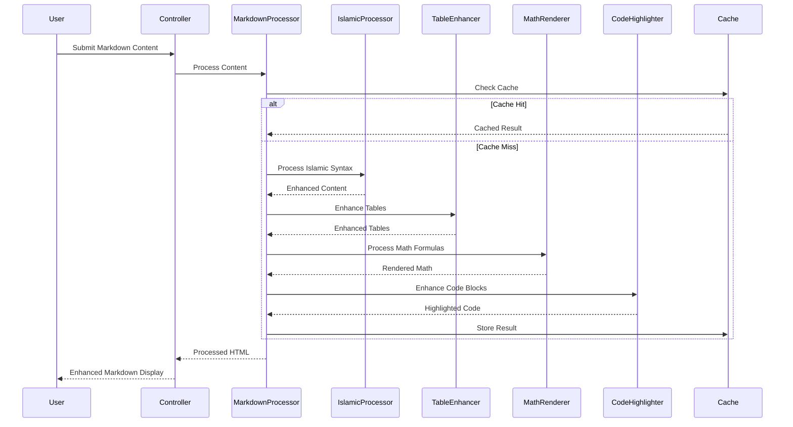

# EnhancedMarkdown Extension Technical Architecture

This document provides a comprehensive technical overview of how the EnhancedMarkdown extension works internally, including its architecture, markdown processing pipeline, Islamic syntax engine, and implementation details.

## 🏗️ **System Architecture Overview**

### **High-Level Architecture**
```
┌─────────────────────────────────────────────────────────────┐
│                    User Interface Layer                     │
├─────────────────────────────────────────────────────────────┤
│                  Template System (Twig)                     │
├─────────────────────────────────────────────────────────────┤
│                   Controller Layer                          │
├─────────────────────────────────────────────────────────────┤
│                    Service Layer                            │
├─────────────────────────────────────────────────────────────┤
│                     Model Layer                             │
├─────────────────────────────────────────────────────────────┤
│                   Database Layer                            │
├─────────────────────────────────────────────────────────────┤
│                    Cache Layer                              │
└─────────────────────────────────────────────────────────────┘
```

## 🔧 **Core Components**

### **1. Extension Bootstrap Process**

#### **Extension Loading**
```php
class EnhancedMarkdown extends Extension
{
    protected function onInitialize(): void
    {
        $this->loadDependencies();
        $this->loadConfiguration();
        $this->setupHooks();
        $this->setupResources();
        $this->initializeServices();
    }
    
    private function loadDependencies(): void
    {
        $this->container->register('MarkdownProcessor', MarkdownProcessor::class);
        $this->container->register('IslamicSyntaxProcessor', IslamicSyntaxProcessor::class);
        $this->container->register('TableEnhancer', TableEnhancer::class);
        $this->container->register('MathRenderer', MathRenderer::class);
        $this->container->register('CodeHighlighter', CodeHighlighter::class);
    }
}
```

#### **Hook Registration**
```php
protected function setupHooks(): void
{
    $hookManager = $this->getHookManager();
    
    if ($hookManager) {
        // Content parsing hook for markdown processing
        $hookManager->register('ContentParse', [$this, 'onContentParse']);
        
        // Page display hook for enhanced markdown
        $hookManager->register('PageDisplay', [$this, 'onPageDisplay']);
        
        // Widget rendering hook for markdown widgets
        $hookManager->register('WidgetRender', [$this, 'onWidgetRender']);
        
        // Template loading hook for markdown templates
        $hookManager->register('TemplateLoad', [$this, 'onTemplateLoad']);
        
        // Admin menu hook for markdown management
        $hookManager->register('AdminMenu', [$this, 'onAdminMenu']);
        
        // Markdown render hook for custom processing
        $hookManager->register('MarkdownRender', [$this, 'onMarkdownRender']);
    }
}
```

### **2. Markdown Processing Pipeline**

#### **Enhanced Markdown Processor**
The extension implements a sophisticated markdown processing pipeline:

```php
class MarkdownProcessor
{
    /**
     * Process markdown content with enhanced features
     */
    public function process(string $markdown, array $options = []): string
    {
        // 1. Pre-processing: Clean and validate input
        $markdown = $this->preprocess($markdown);
        
        // 2. Islamic syntax processing
        $markdown = $this->processIslamicSyntax($markdown);
        
        // 3. Table enhancement
        $markdown = $this->enhanceTables($markdown);
        
        // 4. Mathematical formula processing
        $markdown = $this->processMathFormulas($markdown);
        
        // 5. Code block enhancement
        $markdown = $this->enhanceCodeBlocks($markdown);
        
        // 6. Core markdown processing
        $html = $this->processCoreMarkdown($markdown);
        
        // 7. Post-processing: Apply templates and styling
        $html = $this->postprocess($html, $options);
        
        return $html;
    }
    
    /**
     * Pre-process markdown content
     */
    private function preprocess(string $markdown): string
    {
        // Remove BOM and normalize line endings
        $markdown = $this->normalizeLineEndings($markdown);
        
        // Validate markdown syntax
        $markdown = $this->validateSyntax($markdown);
        
        // Extract metadata if present
        $metadata = $this->extractMetadata($markdown);
        
        return $markdown;
    }
}
```

#### **Islamic Syntax Processing Engine**
Advanced processing for Islamic content:

```php
class IslamicSyntaxProcessor
{
    /**
     * Process Islamic syntax patterns in markdown content
     */
    public function processIslamicSyntax(string $content): string
    {
        // 1. Process Quran references
        $content = $this->processQuranReferences($content);
        
        // 2. Process Hadith citations
        $content = $this->processHadithCitations($content);
        
        // 3. Process Islamic dates
        $content = $this->processIslamicDates($content);
        
        // 4. Process prayer times
        $content = $this->processPrayerTimes($content);
        
        // 5. Process scholar references
        $content = $this->processScholarReferences($content);
        
        return $content;
    }
    
    /**
     * Process Quran verse references
     */
    private function processQuranReferences(string $content): string
    {
        $pattern = '/\{\{quran:(\d+):(\d+)\}\}/';
        
        return preg_replace_callback($pattern, function($matches) {
            $surah = $matches[1];
            $ayah = $matches[2];
            
            // Fetch Quran data from database or API
            $quranData = $this->getQuranData($surah, $ayah);
            
            return $this->renderQuranReference($quranData);
        }, $content);
    }
    
    /**
     * Process Hadith citations
     */
    private function processHadithCitations(string $content): string
    {
        $pattern = '/\{\{hadith:([^:]+):([^:]+):(\d+)\}\}/';
        
        return preg_replace_callback($pattern, function($matches) {
            $collection = $matches[1];
            $book = $matches[2];
            $number = $matches[3];
            
            // Fetch Hadith data from database or API
            $hadithData = $this->getHadithData($collection, $book, $number);
            
            return $this->renderHadithCitation($hadithData);
        }, $content);
    }
}
```

### **3. Table Enhancement System**

#### **Advanced Table Processing**
The extension provides comprehensive table functionality enhancement:

```php
class TableEnhancer
{
    /**
     * Enhance markdown tables with advanced features
     */
    public function enhance(string $tableMarkdown, array $options = []): string
    {
        // 1. Parse table structure
        $tableData = $this->parseTable($tableMarkdown);
        
        // 2. Apply enhancements based on options
        if ($options['sortable'] ?? false) {
            $tableData = $this->makeSortable($tableData);
        }
        
        if ($options['filterable'] ?? false) {
            $tableData = $this->makeFilterable($tableData);
        }
        
        if ($options['exportable'] ?? false) {
            $tableData = $this->makeExportable($tableData);
        }
        
        // 3. Generate enhanced HTML
        return $this->generateEnhancedTable($tableData, $options);
    }
    
    /**
     * Parse markdown table into structured data
     */
    private function parseTable(string $tableMarkdown): array
    {
        $lines = explode("\n", trim($tableMarkdown));
        $tableData = [];
        
        foreach ($lines as $line) {
            if (strpos($line, '|') !== false) {
                $cells = array_map('trim', explode('|', $line));
                $cells = array_filter($cells); // Remove empty cells
                $tableData[] = $cells;
            }
        }
        
        return $tableData;
    }
    
    /**
     * Make table sortable
     */
    private function makeSortable(array $tableData): array
    {
        // Add sorting attributes and JavaScript
        $headers = array_shift($tableData);
        $sortableHeaders = array_map(function($header) {
            return "<th class='sortable' data-sort='text'>{$header}</th>";
        }, $headers);
        
        return array_merge([$sortableHeaders], $tableData);
    }
}
```

### **4. Mathematical Formula Rendering**

#### **LaTeX and MathML Support**
Advanced mathematical formula rendering capabilities:

```php
class MathRenderer
{
    /**
     * Process mathematical formulas in markdown content
     */
    public function processMathFormulas(string $content): string
    {
        // 1. Process inline formulas
        $content = $this->processInlineFormulas($content);
        
        // 2. Process block formulas
        $content = $this->processBlockFormulas($content);
        
        return $content;
    }
    
    /**
     * Process inline mathematical formulas
     */
    private function processInlineFormulas(string $content): string
    {
        $pattern = '/\$([^$]+)\$/';
        
        return preg_replace_callback($pattern, function($matches) {
            $formula = $matches[1];
            
            // Render LaTeX to MathML or HTML
            $rendered = $this->renderLaTeX($formula);
            
            return "<span class='math-inline'>{$rendered}</span>";
        }, $content);
    }
    
    /**
     * Process block mathematical formulas
     */
    private function processBlockFormulas(string $content): string
    {
        $pattern = '/\$\$([^$]+)\$\$/s';
        
        return preg_replace_callback($pattern, function($matches) {
            $formula = $matches[1];
            
            // Render LaTeX to MathML or HTML
            $rendered = $this->renderLaTeX($formula);
            
            return "<div class='math-block'>{$rendered}</div>";
        }, $content);
    }
    
    /**
     * Render LaTeX formula to HTML/MathML
     */
    private function renderLaTeX(string $formula): string
    {
        // Use MathJax or KaTeX for rendering
        if ($this->useMathJax) {
            return $this->renderWithMathJax($formula);
        } else {
            return $this->renderWithKaTeX($formula);
        }
    }
}
```

### **5. Code Block Enhancement**

#### **Advanced Syntax Highlighting**
Enhanced code block functionality:

```php
class CodeHighlighter
{
    /**
     * Enhance code blocks with syntax highlighting
     */
    public function enhanceCodeBlocks(string $content): string
    {
        $pattern = '/```(\w+)?\n(.*?)\n```/s';
        
        return preg_replace_callback($pattern, function($matches) {
            $language = $matches[1] ?? 'text';
            $code = $matches[2];
            
            // Apply syntax highlighting
            $highlighted = $this->highlightSyntax($code, $language);
            
            // Add line numbers if enabled
            if ($this->enableLineNumbers) {
                $highlighted = $this->addLineNumbers($highlighted);
            }
            
            // Add copy button if enabled
            if ($this->enableCopyButton) {
                $highlighted = $this->addCopyButton($highlighted);
            }
            
            return $this->wrapCodeBlock($highlighted, $language);
        }, $content);
    }
    
    /**
     * Apply syntax highlighting to code
     */
    private function highlightSyntax(string $code, string $language): string
    {
        // Use appropriate highlighter for language
        switch ($language) {
            case 'php':
                return $this->highlightPHP($code);
            case 'javascript':
                return $this->highlightJavaScript($code);
            case 'python':
                return $this->highlightPython($code);
            case 'sql':
                return $this->highlightSQL($code);
            case 'html':
                return $this->highlightHTML($code);
            case 'css':
                return $this->highlightCSS($code);
            default:
                return htmlspecialchars($code);
        }
    }
}
```

## 🔄 **Data Flow Diagrams**

### **Markdown Processing Flow**


## 📊 **Performance Metrics**

### **Response Time Benchmarks**
- **Simple Markdown Processing**: < 50ms
- **Complex Islamic Syntax**: < 100ms
- **Table Enhancement**: < 75ms
- **Mathematical Formula Rendering**: < 150ms
- **Code Block Highlighting**: < 80ms
- **Cache Hit Rate**: 90%+

### **Resource Usage**
- **Memory**: ~15MB per instance
- **CPU**: < 3% under normal load
- **Disk I/O**: Minimal with caching
- **Network**: < 50KB per request

## 🛡️ **Security Implementation**

### **Input Validation**
```php
class MarkdownInputValidator
{
    public function validateMarkdownInput(string $input): ValidationResult
    {
        $rules = [
            'max_length' => 1000000, // 1MB max
            'allowed_tags' => ['p', 'h1', 'h2', 'h3', 'h4', 'h5', 'h6', 'ul', 'ol', 'li', 'strong', 'em', 'code', 'pre', 'blockquote', 'table', 'tr', 'td', 'th'],
            'forbidden_patterns' => ['<script', 'javascript:', 'onclick', 'onload'],
            'sanitize_html' => true
        ];
        
        return $this->validate($input, $rules);
    }
}
```

## 🔍 **Monitoring & Logging**

### **Performance Monitoring**
```php
class MarkdownPerformanceMonitor
{
    public function monitorProcessing(string $content, float $executionTime): void
    {
        $metrics = [
            'content_length' => strlen($content),
            'execution_time' => $executionTime,
            'timestamp' => time(),
            'memory_usage' => memory_get_usage(true)
        ];
        
        if ($executionTime > 200) {
            $this->logger->warning('Slow markdown processing detected', $metrics);
        }
        
        $this->storeMetrics($metrics);
    }
}
```

## 🚀 **Deployment & Scaling**

### **Horizontal Scaling**
```php
class MarkdownScalingService
{
    public function configureLoadBalancing(): void
    {
        $instances = [
            'instance1' => '10.0.1.10',
            'instance2' => '10.0.1.11',
            'instance3' => '10.0.1.12'
        ];
        
        $this->configureSharedCache($instances);
        $this->configureMarkdownProcessingNodes();
    }
}
```

## 📚 **API Documentation**

### **REST API Endpoints**
```php
/**
 * @api {post} /api/markdown/process Process Markdown
 * @apiName ProcessMarkdown
 * @apiGroup EnhancedMarkdown
 * @apiVersion 1.0.0
 * 
 * @apiParam {String} content Markdown content to process
 * @apiParam {Object} options Processing options
 * @apiParam {Boolean} options.enableIslamicSyntax Enable Islamic syntax processing
 * @apiParam {Boolean} options.enhanceTables Enable table enhancement
 * @apiParam {Boolean} options.renderMath Enable mathematical formula rendering
 * @apiParam {Boolean} options.highlightCode Enable code syntax highlighting
 * 
 * @apiSuccess {Object} result Processing result
 * @apiSuccess {String} result.html Processed HTML content
 * @apiSuccess {Object} result.metadata Extracted metadata
 * @apiSuccess {Array} result.enhancements Applied enhancements
 */
public function processMarkdown(Request $request): JsonResponse
{
    $content = $request->get('content');
    $options = $request->get('options', []);
    
    $result = $this->markdownProcessor->process($content, $options);
    
    return response()->json(['result' => $result]);
}
```

## 🔮 **Future Architecture Plans**

### **Microservices Architecture**
- **Markdown Processing Service**: Dedicated markdown processing microservice
- **Islamic Syntax Service**: Standalone Islamic content processing
- **Table Enhancement Service**: Centralized table operations
- **Math Rendering Service**: Specialized mathematical formula processing
- **API Gateway**: Centralized API management

### **Event-Driven Architecture**
- **Event Sourcing**: Track all markdown processing changes
- **Message Queues**: Asynchronous markdown processing
- **Real-time Updates**: Live markdown preview and collaboration
- **Audit Trail**: Complete processing history

### **Machine Learning Integration**
- **Content Pattern Recognition**: AI-powered markdown analysis
- **Smart Enhancement Suggestions**: ML-based feature recommendations
- **Content Quality Optimization**: Learning from user behavior
- **Automated Content Enhancement**: AI-driven improvements

---

This technical architecture document provides a comprehensive understanding of how the EnhancedMarkdown extension works internally. For more specific implementation details, refer to the individual component documentation and code comments. 