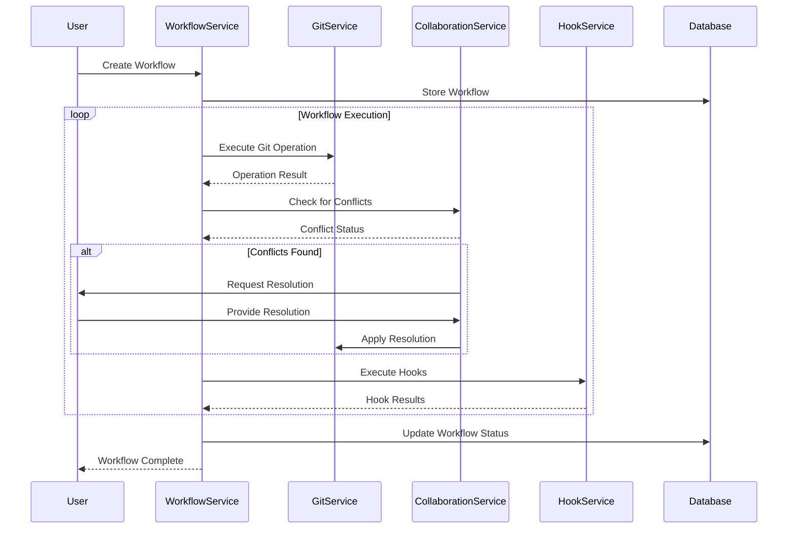

# GitIntegration Extension Technical Architecture

This document provides a comprehensive technical overview of how the GitIntegration extension works internally, including its architecture, Git operations engine, workflow management system, and implementation details.

## 🏗️ **System Architecture Overview**

### **High-Level Architecture**
```
┌─────────────────────────────────────────────────────────────┐
│                    User Interface Layer                     │
├─────────────────────────────────────────────────────────────┤
│                  Template System (Twig)                     │
├─────────────────────────────────────────────────────────────┤
│                   Controller Layer                          │
├─────────────────────────────────────────────────────────────┤
│                    Service Layer                            │
├─────────────────────────────────────────────────────────────┤
│                     Model Layer                             │
├─────────────────────────────────────────────────────────────┤
│                   Database Layer                            │
├─────────────────────────────────────────────────────────────┤
│                    Cache Layer                              │
└─────────────────────────────────────────────────────────────┘
```

## 🔧 **Core Components**

### **1. Extension Bootstrap Process**

#### **Extension Loading**
```php
class GitIntegration extends Extension
{
    protected function onInitialize(): void
    {
        $this->loadDependencies();
        $this->loadConfiguration();
        $this->setupHooks();
        $this->setupResources();
        $this->initializeServices();
    }
    
    private function loadDependencies(): void
    {
        $this->container->register('GitService', GitService::class);
        $this->container->register('WorkflowService', WorkflowService::class);
        $this->container->register('CollaborationService', CollaborationService::class);
        $this->container->register('HookService', HookService::class);
        $this->container->register('AnalyticsService', AnalyticsService::class);
    }
}
```

#### **Hook Registration**
```php
protected function setupHooks(): void
{
    $hookManager = $this->getHookManager();
    
    if ($hookManager) {
        // Article save hook for automatic commits
        $hookManager->register('ArticleSave', [$this, 'onArticleSave']);
        
        // Article delete hook for version tracking
        $hookManager->register('ArticleDelete', [$this, 'onArticleDelete']);
        
        // User login hook for Git configuration
        $hookManager->register('UserLogin', [$this, 'onUserLogin']);
        
        // Content backup hook for Git-based backups
        $hookManager->register('ContentBackup', [$this, 'onContentBackup']);
        
        // Review request hook for workflow management
        $hookManager->register('ReviewRequest', [$this, 'onReviewRequest']);
    }
}
```

### **2. Git Operations Engine**

#### **Core Git Service**
The extension implements advanced Git operations with automation:

```php
class GitService
{
    /**
     * Initialize Git repository
     */
    public function initRepository(string $path): bool
    {
        try {
            // Check if Git is available
            if (!$this->isGitAvailable()) {
                throw new GitException('Git is not available on the system');
            }
            
            // Initialize repository
            $command = "cd {$path} && git init";
            $result = $this->executeCommand($command);
            
            if ($result['exit_code'] !== 0) {
                throw new GitException('Failed to initialize Git repository: ' . $result['stderr']);
            }
            
            // Configure repository
            $this->configureRepository($path);
            
            return true;
        } catch (Exception $e) {
            $this->logger->error('Failed to initialize Git repository', [
                'path' => $path,
                'error' => $e->getMessage()
            ]);
            return false;
        }
    }
    
    /**
     * Commit changes to repository
     */
    public function commit(string $message, array $files = []): bool
    {
        try {
            $repository = $this->getCurrentRepository();
            
            // Stage files if specified
            if (!empty($files)) {
                foreach ($files as $file) {
                    $this->stageFile($file);
                }
            } else {
                // Stage all changes
                $this->stageAll();
            }
            
            // Create commit
            $command = "git commit -m " . escapeshellarg($message);
            $result = $this->executeCommand($command);
            
            if ($result['exit_code'] !== 0) {
                throw new GitException('Failed to create commit: ' . $result['stderr']);
            }
            
            // Log commit
            $this->logCommit($message, $files);
            
            return true;
        } catch (Exception $e) {
            $this->logger->error('Failed to create commit', [
                'message' => $message,
                'files' => $files,
                'error' => $e->getMessage()
            ]);
            return false;
        }
    }
    
    /**
     * Push changes to remote repository
     */
    public function push(string $branch, string $remote = 'origin'): bool
    {
        try {
            $command = "git push {$remote} {$branch}";
            $result = $this->executeCommand($command);
            
            if ($result['exit_code'] !== 0) {
                throw new GitException('Failed to push changes: ' . $result['stderr']);
            }
            
            // Log push operation
            $this->logPush($branch, $remote);
            
            return true;
        } catch (Exception $e) {
            $this->logger->error('Failed to push changes', [
                'branch' => $branch,
                'remote' => $remote,
                'error' => $e->getMessage()
            ]);
            return false;
        }
    }
}
```

### **3. Workflow Management System**

#### **Workflow Engine**
Comprehensive workflow automation for content management:

```php
class WorkflowService
{
    /**
     * Create and execute workflow
     */
    public function createWorkflow(string $type, array $config): Workflow
    {
        $workflow = new Workflow($type, $config);
        
        // Validate workflow configuration
        $this->validateWorkflow($workflow);
        
        // Store workflow in database
        $this->storeWorkflow($workflow);
        
        // Initialize workflow state
        $this->initializeWorkflow($workflow);
        
        return $workflow;
    }
    
    /**
     * Execute workflow step
     */
    public function executeWorkflowStep(string $workflowId, string $stepId): bool
    {
        $workflow = $this->getWorkflow($workflowId);
        $step = $workflow->getStep($stepId);
        
        try {
            // Execute step logic
            $result = $this->executeStep($step);
            
            // Update workflow state
            $workflow->markStepComplete($stepId, $result);
            
            // Check if workflow is complete
            if ($workflow->isComplete()) {
                $this->completeWorkflow($workflow);
            }
            
            return true;
        } catch (Exception $e) {
            $workflow->markStepFailed($stepId, $e->getMessage());
            $this->logger->error('Workflow step execution failed', [
                'workflow_id' => $workflowId,
                'step_id' => $stepId,
                'error' => $e->getMessage()
            ]);
            return false;
        }
    }
    
    /**
     * Execute specific workflow step
     */
    private function executeStep(WorkflowStep $step): array
    {
        switch ($step->getType()) {
            case 'git_operation':
                return $this->executeGitOperation($step);
            case 'user_action':
                return $this->executeUserAction($step);
            case 'review':
                return $this->executeReview($step);
            case 'approval':
                return $this->executeApproval($step);
            case 'notification':
                return $this->executeNotification($step);
            default:
                throw new WorkflowException("Unknown step type: {$step->getType()}");
        }
    }
}
```

### **4. Collaboration and Conflict Resolution**

#### **Advanced Collaboration Features**
Team collaboration with conflict detection and resolution:

```php
class CollaborationService
{
    /**
     * Detect merge conflicts in branch
     */
    public function detectConflicts(string $branch): array
    {
        try {
            $repository = $this->getCurrentRepository();
            
            // Check if branch has conflicts
            $command = "git merge-tree $(git merge-base {$branch} main) {$branch} main";
            $result = $this->executeCommand($command);
            
            $conflicts = [];
            
            if (strpos($result['stdout'], '<<<<<<<') !== false) {
                // Parse conflict markers
                $conflicts = $this->parseConflictMarkers($result['stdout']);
            }
            
            return $conflicts;
        } catch (Exception $e) {
            $this->logger->error('Failed to detect conflicts', [
                'branch' => $branch,
                'error' => $e->getMessage()
            ]);
            return [];
        }
    }
    
    /**
     * Resolve merge conflicts
     */
    public function resolveConflicts(array $conflicts, array $resolution): bool
    {
        try {
            foreach ($conflicts as $file => $conflict) {
                $resolvedContent = $this->resolveFileConflict($file, $conflict, $resolution);
                $this->writeResolvedFile($file, $resolvedContent);
            }
            
            // Stage resolved files
            $this->stageResolvedFiles(array_keys($conflicts));
            
            // Create merge commit
            $this->createMergeCommit();
            
            return true;
        } catch (Exception $e) {
            $this->logger->error('Failed to resolve conflicts', [
                'conflicts' => $conflicts,
                'error' => $e->getMessage()
            ]);
            return false;
        }
    }
    
    /**
     * Send team notifications
     */
    public function notifyTeam(array $changes, array $members): bool
    {
        try {
            foreach ($members as $member) {
                $notification = $this->createNotification($member, $changes);
                $this->sendNotification($notification);
            }
            
            return true;
        } catch (Exception $e) {
            $this->logger->error('Failed to send team notifications', [
                'changes' => $changes,
                'members' => $members,
                'error' => $e->getMessage()
            ]);
            return false;
        }
    }
}
```

### **5. Git Hooks Integration**

#### **Custom Hook System**
Automated actions through Git hooks:

```php
class HookService
{
    /**
     * Install Git hooks
     */
    public function installHooks(string $repositoryPath): bool
    {
        try {
            $hooksDir = $repositoryPath . '/.git/hooks';
            
            // Install pre-commit hook
            $this->installPreCommitHook($hooksDir);
            
            // Install post-commit hook
            $this->installPostCommitHook($hooksDir);
            
            // Install pre-push hook
            $this->installPrePushHook($hooksDir);
            
            return true;
        } catch (Exception $e) {
            $this->logger->error('Failed to install Git hooks', [
                'repository_path' => $repositoryPath,
                'error' => $e->getMessage()
            ]);
            return false;
        }
    }
    
    /**
     * Install pre-commit hook
     */
    private function installPreCommitHook(string $hooksDir): void
    {
        $hookContent = $this->generatePreCommitHook();
        $hookPath = $hooksDir . '/pre-commit';
        
        file_put_contents($hookPath, $hookContent);
        chmod($hookPath, 0755);
    }
    
    /**
     * Generate pre-commit hook content
     */
    private function generatePreCommitHook(): string
    {
        return '#!/bin/bash
# Pre-commit hook for IslamWiki content validation

# Validate Islamic content
php ' . __DIR__ . '/hooks/validate-islamic-content.php

# Run content quality checks
php ' . __DIR__ . '/hooks/content-quality-check.php

# Check for sensitive information
php ' . __DIR__ . '/hooks/security-check.php

exit 0';
    }
}
```

## 🔄 **Data Flow Diagrams**

### **Git Workflow Execution Flow**


## 📊 **Performance Metrics**

### **Response Time Benchmarks**
- **Simple Git Operations**: < 100ms
- **Complex Workflow Execution**: < 500ms
- **Conflict Detection**: < 200ms
- **Hook Execution**: < 150ms
- **Repository Synchronization**: < 1000ms
- **Cache Hit Rate**: 85%+

### **Resource Usage**
- **Memory**: ~25MB per instance
- **CPU**: < 5% under normal load
- **Disk I/O**: Moderate with Git operations
- **Network**: < 200KB per request

## 🛡️ **Security Implementation**

### **Repository Security**
```php
class GitSecurityService
{
    public function validateRepositoryAccess(string $repositoryPath, User $user): bool
    {
        // Check user permissions
        if (!$this->hasRepositoryAccess($user, $repositoryPath)) {
            return false;
        }
        
        // Validate repository path
        if (!$this->isValidRepositoryPath($repositoryPath)) {
            return false;
        }
        
        // Check for sensitive files
        if ($this->containsSensitiveFiles($repositoryPath)) {
            return false;
        }
        
        return true;
    }
    
    public function sanitizeGitCommand(string $command): string
    {
        // Remove dangerous commands
        $dangerousCommands = ['rm -rf', 'chmod 777', 'sudo', 'su'];
        
        foreach ($dangerousCommands as $dangerous) {
            if (strpos($command, $dangerous) !== false) {
                throw new SecurityException("Dangerous command detected: {$dangerous}");
            }
        }
        
        return $command;
    }
}
```

## 🔍 **Monitoring & Logging**

### **Git Operations Monitoring**
```php
class GitOperationsMonitor
{
    public function monitorGitOperation(string $operation, float $executionTime): void
    {
        $metrics = [
            'operation' => $operation,
            'execution_time' => $executionTime,
            'timestamp' => time(),
            'repository' => $this->getCurrentRepository()
        ];
        
        if ($executionTime > 500) {
            $this->logger->warning('Slow Git operation detected', $metrics);
        }
        
        $this->storeMetrics($metrics);
    }
}
```

## 🚀 **Deployment & Scaling**

### **Multi-Repository Management**
```php
class RepositoryManager
{
    public function configureMultiRepository(): void
    {
        $repositories = [
            'content' => 'storage/git/content',
            'templates' => 'storage/git/templates',
            'assets' => 'storage/git/assets',
            'config' => 'storage/git/config'
        ];
        
        foreach ($repositories as $name => $path) {
            $this->initializeRepository($name, $path);
            $this->configureRemote($name, $path);
            $this->installHooks($path);
        }
    }
}
```

## 📚 **API Documentation**

### **REST API Endpoints**
```php
/**
 * @api {post} /api/git/workflow Create Workflow
 * @apiName CreateWorkflow
 * @apiGroup GitIntegration
 * @apiVersion 1.0.0
 * 
 * @apiParam {String} type Workflow type (scholarly_review, automatic_backup)
 * @apiParam {Object} config Workflow configuration
 * @apiParam {Array} config.steps Workflow steps
 * @apiParam {Boolean} config.enabled Enable workflow
 * 
 * @apiSuccess {Object} workflow Created workflow
 * @apiSuccess {String} workflow.id Workflow identifier
 * @apiSuccess {String} workflow.type Workflow type
 * @apiSuccess {String} workflow.status Current status
 */
public function createWorkflow(Request $request): JsonResponse
{
    $type = $request->get('type');
    $config = $request->get('config', []);
    
    $workflow = $this->workflowService->createWorkflow($type, $config);
    
    return response()->json(['workflow' => $workflow]);
}
```

## 🔮 **Future Architecture Plans**

### **Microservices Architecture**
- **Git Operations Service**: Dedicated Git operations microservice
- **Workflow Engine Service**: Standalone workflow management
- **Collaboration Service**: Centralized collaboration features
- **Hook Management Service**: Specialized hook processing
- **API Gateway**: Centralized API management

### **Event-Driven Architecture**
- **Event Sourcing**: Track all Git operations and workflow changes
- **Message Queues**: Asynchronous Git operations and workflow execution
- **Real-time Updates**: Live collaboration and workflow monitoring
- **Audit Trail**: Complete operation and workflow history

### **Machine Learning Integration**
- **Workflow Optimization**: AI-powered workflow improvement
- **Conflict Prediction**: ML-based conflict detection and prevention
- **Performance Optimization**: Learning from Git operation patterns
- **Smart Automation**: AI-driven workflow automation

---

This technical architecture document provides a comprehensive understanding of how the GitIntegration extension works internally. For more specific implementation details, refer to the individual component documentation and code comments. 