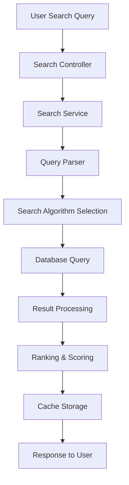
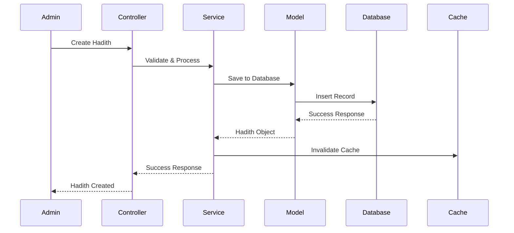
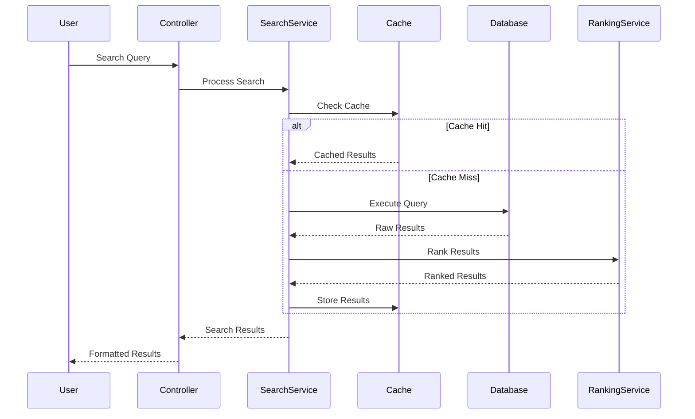

# HadithExtension Technical Architecture

This document provides a comprehensive technical overview of how the HadithExtension works internally, including its architecture, data flow, and implementation details.

## 🏗️ **System Architecture Overview**

### **High-Level Architecture**
```
┌─────────────────────────────────────────────────────────────┐
│                    User Interface Layer                     │
├─────────────────────────────────────────────────────────────┤
│                  Template System (Twig)                     │
├─────────────────────────────────────────────────────────────┤
│                   Controller Layer                          │
├─────────────────────────────────────────────────────────────┤
│                    Service Layer                            │
├─────────────────────────────────────────────────────────────┤
│                     Model Layer                             │
├─────────────────────────────────────────────────────────────┤
│                   Database Layer                            │
├─────────────────────────────────────────────────────────────┤
│                    Cache Layer                              │
└─────────────────────────────────────────────────────────────┘
```

### **Component Relationships**
```
User Request → Controller → Service → Model → Database
                ↓           ↓        ↓
              Template ← Cache ← Service
```

## 🔧 **Core Components**

### **1. Extension Bootstrap Process**

#### **Extension Loading**
```php
class HadithExtension extends Extension
{
    protected function onInitialize(): void
    {
        // 1. Load dependencies
        $this->loadDependencies();
        
        // 2. Load configuration
        $this->loadConfiguration();
        
        // 3. Setup hooks
        $this->setupHooks();
        
        // 4. Setup resources
        $this->setupResources();
        
        // 5. Initialize services
        $this->initializeServices();
    }
    
    private function loadDependencies(): void
    {
        // Load required classes and dependencies
        $this->container->register('HadithSearchService', HadithSearchService::class);
        $this->container->register('AuthenticityService', AuthenticityService::class);
        $this->container->register('ChainAnalysisService', ChainAnalysisService::class);
        $this->container->register('CommentaryService', CommentaryService::class);
        $this->container->register('CacheService', CacheService::class);
    }
}
```

#### **Hook Registration**
```php
protected function setupHooks(): void
{
    $hookManager = $this->getHookManager();
    
    if ($hookManager) {
        // Content parsing hook for hadith detection
        $hookManager->register('ContentParse', [$this, 'onContentParse']);
        
        // Page display hook for hadith widgets
        $hookManager->register('PageDisplay', [$this, 'onPageDisplay']);
        
        // Search indexing hook for hadith content
        $hookManager->register('SearchIndex', [$this, 'onSearchIndex']);
        
        // Widget rendering hook for hadith widgets
        $hookManager->register('WidgetRender', [$this, 'onWidgetRender']);
        
        // Template loading hook for hadith templates
        $hookManager->register('TemplateLoad', [$this, 'onTemplateLoad']);
        
        // Admin menu hook for hadith management
        $hookManager->register('AdminMenu', [$this, 'onAdminMenu']);
        
        // User profile hook for personal hadith preferences
        $hookManager->register('UserProfile', [$this, 'onUserProfile']);
    }
}
```

### **2. Data Flow Architecture**

#### **Hadith Search Flow**


#### **Detailed Search Process**
```php
class HadithSearchService
{
    public function searchHadiths(string $query, array $filters = []): array
    {
        // 1. Parse and validate query
        $parsedQuery = $this->parseQuery($query);
        
        // 2. Check cache for existing results
        $cacheKey = $this->generateCacheKey($parsedQuery, $filters);
        if ($cachedResults = $this->cache->get($cacheKey)) {
            return $cachedResults;
        }
        
        // 3. Execute search algorithms
        $results = $this->executeSearchAlgorithms($parsedQuery, $filters);
        
        // 4. Apply filters and ranking
        $filteredResults = $this->applyFilters($results, $filters);
        $rankedResults = $this->rankResults($filteredResults, $parsedQuery);
        
        // 5. Cache results
        $this->cache->set($cacheKey, $rankedResults, 3600); // 1 hour
        
        return $rankedResults;
    }
    
    private function executeSearchAlgorithms(Query $query, array $filters): array
    {
        $results = [];
        
        // Algorithm 1: Exact text matching (highest priority)
        $exactMatches = $this->exactTextSearch($query);
        $results = array_merge($results, $exactMatches);
        
        // Algorithm 2: Fuzzy matching for spelling variations
        $fuzzyMatches = $this->fuzzyTextSearch($query);
        $results = array_merge($results, $fuzzyMatches);
        
        // Algorithm 3: Semantic search with keyword expansion
        $semanticMatches = $this->semanticSearch($query);
        $results = array_merge($results, $semanticMatches);
        
        // Algorithm 4: Narrator-based search
        $narratorMatches = $this->narratorSearch($query);
        $results = array_merge($results, $narratorMatches);
        
        return $results;
    }
}
```

### **3. Database Architecture**

#### **Core Tables Structure**
```sql
-- Hadiths table - Core hadith information
CREATE TABLE hadiths (
    id BIGINT PRIMARY KEY AUTO_INCREMENT,
    collection_id BIGINT NOT NULL,
    hadith_number VARCHAR(50) NOT NULL,
    arabic_text TEXT NOT NULL,
    english_text TEXT,
    urdu_text TEXT,
    turkish_text TEXT,
    indonesian_text TEXT,
    narrator_chain TEXT NOT NULL,
    authenticity_grade ENUM('Sahih', 'Hasan', 'Daif', 'Mawdu') NOT NULL,
    authenticity_score DECIMAL(3,2),
    collection_page INT,
    compilation_date DATE,
    created_at TIMESTAMP DEFAULT CURRENT_TIMESTAMP,
    updated_at TIMESTAMP DEFAULT CURRENT_TIMESTAMP ON UPDATE CURRENT_TIMESTAMP,
    
    -- Indexes for performance
    INDEX idx_collection_number (collection_id, hadith_number),
    INDEX idx_authenticity (authenticity_grade, authenticity_score),
    INDEX idx_compilation_date (compilation_date),
    FULLTEXT idx_text_search (arabic_text, english_text, urdu_text, turkish_text, indonesian_text),
    
    -- Foreign key constraints
    FOREIGN KEY (collection_id) REFERENCES collections(id) ON DELETE CASCADE
);

-- Narrators table - Narrator information and reliability
CREATE TABLE narrators (
    id BIGINT PRIMARY KEY AUTO_INCREMENT,
    name_arabic VARCHAR(255) NOT NULL,
    name_english VARCHAR(255),
    name_urdu VARCHAR(255),
    name_turkish VARCHAR(255),
    name_indonesian VARCHAR(255),
    reliability_score DECIMAL(3,2) DEFAULT 0.00,
    reliability_grade ENUM('Thiqah', 'Saduq', 'Daif', 'Munkar') DEFAULT 'Daif',
    death_year INT,
    birth_year INT,
    location VARCHAR(255),
    biography TEXT,
    scholarly_consensus TEXT,
    created_at TIMESTAMP DEFAULT CURRENT_TIMESTAMP,
    updated_at TIMESTAMP DEFAULT CURRENT_TIMESTAMP ON UPDATE CURRENT_TIMESTAMP,
    
    -- Indexes
    INDEX idx_name (name_arabic, name_english),
    INDEX idx_reliability (reliability_score, reliability_grade),
    INDEX idx_location (location),
    INDEX idx_death_year (death_year)
);

-- Collections table - Hadith collection information
CREATE TABLE collections (
    id BIGINT PRIMARY KEY AUTO_INCREMENT,
    name_arabic VARCHAR(255) NOT NULL,
    name_english VARCHAR(255) NOT NULL,
    name_urdu VARCHAR(255),
    name_turkish VARCHAR(255),
    name_indonesian VARCHAR(255),
    author VARCHAR(255),
    author_arabic VARCHAR(255),
    compilation_year INT,
    authenticity_standard ENUM('Strict', 'Moderate', 'Liberal') DEFAULT 'Moderate',
    total_hadiths INT DEFAULT 0,
    description TEXT,
    created_at TIMESTAMP DEFAULT CURRENT_TIMESTAMP,
    updated_at TIMESTAMP DEFAULT CURRENT_TIMESTAMP ON UPDATE CURRENT_TIMESTAMP,
    
    -- Indexes
    INDEX idx_name (name_arabic, name_english),
    INDEX idx_author (author),
    INDEX idx_compilation_year (compilation_year),
    INDEX idx_authenticity_standard (authenticity_standard)
);

-- Commentary table - Scholarly interpretations
CREATE TABLE commentaries (
    id BIGINT PRIMARY KEY AUTO_INCREMENT,
    hadith_id BIGINT NOT NULL,
    scholar_name VARCHAR(255) NOT NULL,
    scholar_arabic VARCHAR(255),
    school_of_thought VARCHAR(100),
    commentary_text TEXT NOT NULL,
    language ENUM('Arabic', 'English', 'Urdu', 'Turkish', 'Indonesian') DEFAULT 'English',
    commentary_type ENUM('Explanation', 'Context', 'Ruling', 'Historical', 'Linguistic') DEFAULT 'Explanation',
    created_at TIMESTAMP DEFAULT CURRENT_TIMESTAMP,
    updated_at TIMESTAMP DEFAULT CURRENT_TIMESTAMP ON UPDATE CURRENT_TIMESTAMP,
    
    -- Indexes
    INDEX idx_hadith (hadith_id),
    INDEX idx_scholar (scholar_name),
    INDEX idx_language (language),
    INDEX idx_type (commentary_type),
    
    -- Foreign key
    FOREIGN KEY (hadith_id) REFERENCES hadiths(id) ON DELETE CASCADE
);

-- Categories table - Hadith categorization
CREATE TABLE categories (
    id BIGINT PRIMARY KEY AUTO_INCREMENT,
    name_arabic VARCHAR(255) NOT NULL,
    name_english VARCHAR(255) NOT NULL,
    name_urdu VARCHAR(255),
    name_turkish VARCHAR(255),
    name_indonesian VARCHAR(255),
    parent_id BIGINT NULL,
    description TEXT,
    sort_order INT DEFAULT 0,
    created_at TIMESTAMP DEFAULT CURRENT_TIMESTAMP,
    updated_at TIMESTAMP DEFAULT CURRENT_TIMESTAMP ON UPDATE CURRENT_TIMESTAMP,
    
    -- Indexes
    INDEX idx_name (name_arabic, name_english),
    INDEX idx_parent (parent_id),
    INDEX idx_sort_order (sort_order),
    
    -- Foreign key for hierarchical structure
    FOREIGN KEY (parent_id) REFERENCES categories(id) ON DELETE SET NULL
);

-- Hadith-Category relationships
CREATE TABLE hadith_categories (
    hadith_id BIGINT NOT NULL,
    category_id BIGINT NOT NULL,
    created_at TIMESTAMP DEFAULT CURRENT_TIMESTAMP,
    
    PRIMARY KEY (hadith_id, category_id),
    FOREIGN KEY (hadith_id) REFERENCES hadiths(id) ON DELETE CASCADE,
    FOREIGN KEY (category_id) REFERENCES categories(id) ON DELETE CASCADE
);
```

#### **Database Optimization Strategies**
```sql
-- Composite indexes for common query patterns
CREATE INDEX idx_hadith_search ON hadiths(collection_id, authenticity_grade, compilation_date);

-- Partial indexes for filtered queries
CREATE INDEX idx_sahih_hadiths ON hadiths(collection_id, hadith_number) 
WHERE authenticity_grade = 'Sahih';

-- Covering indexes for common SELECT queries
CREATE INDEX idx_hadith_display ON hadiths(id, collection_id, hadith_number, arabic_text, authenticity_grade);

-- Full-text search optimization
ALTER TABLE hadiths ADD FULLTEXT INDEX idx_fulltext_search 
(arabic_text, english_text, urdu_text, turkish_text, indonesian_text);
```

### **4. Caching Architecture**

#### **Multi-Layer Caching System**
```php
class HadithCacheService
{
    private $memoryCache;    // In-memory cache (fastest)
    private $redisCache;     // Redis cache (fast)
    private $fileCache;      // File-based cache (slower)
    
    /**
     * Multi-layer cache implementation with intelligent fallback
     */
    public function getHadith(int $id): ?Hadith
    {
        // Layer 1: Memory cache (fastest, ~1ms)
        if ($hadith = $this->memoryCache->get("hadith:$id")) {
            return $hadith;
        }
        
        // Layer 2: Redis cache (fast, ~5ms)
        if ($hadith = $this->redisCache->get("hadith:$id")) {
            $this->memoryCache->set("hadith:$id", $hadith, 300); // 5 minutes
            return $hadith;
        }
        
        // Layer 3: File cache (slower, ~20ms)
        if ($hadith = $this->fileCache->get("hadith:$id")) {
            $this->redisCache->setex("hadith:$id", 3600, $hadith); // 1 hour
            $this->memoryCache->set("hadith:$id", $hadith, 300);   // 5 minutes
            return $hadith;
        }
        
        // Layer 4: Database (slowest, ~100ms+)
        $hadith = $this->loadFromDatabase($id);
        
        if ($hadith) {
            // Store in all cache layers
            $this->fileCache->set("hadith:$id", $hadith, 86400);   // 24 hours
            $this->redisCache->setex("hadith:$id", 3600, $hadith); // 1 hour
            $this->memoryCache->set("hadith:$id", $hadith, 300);   // 5 minutes
        }
        
        return $hadith;
    }
    
    /**
     * Intelligent cache invalidation
     */
    public function invalidateHadith(int $id): void
    {
        // Invalidate all cache layers
        $this->memoryCache->delete("hadith:$id");
        $this->redisCache->delete("hadith:$id");
        $this->fileCache->delete("hadith:$id");
        
        // Invalidate related caches
        $this->invalidateSearchCache();
        $this->invalidateCollectionCache($id);
        $this->invalidateCategoryCache($id);
    }
    
    /**
     * Cache warming for frequently accessed hadiths
     */
    public function warmCache(array $hadithIds): void
    {
        foreach ($hadithIds as $id) {
            $hadith = $this->loadFromDatabase($id);
            if ($hadith) {
                $this->setHadith($id, $hadith);
            }
        }
    }
}
```

### **5. Search Algorithm Implementation**

#### **Fuzzy Search Algorithm**
```php
class FuzzySearchService
{
    /**
     * Levenshtein distance-based fuzzy search
     */
    public function findSimilarWords(string $word, float $threshold = 0.8): array
    {
        $similarWords = [];
        $wordLength = strlen($word);
        
        // Get all words from the word dictionary
        $dictionary = $this->getWordDictionary();
        
        foreach ($dictionary as $dictWord) {
            $dictWordLength = strlen($dictWord);
            
            // Calculate similarity score
            $distance = $this->levenshteinDistance($word, $dictWord);
            $maxLength = max($wordLength, $dictWordLength);
            $similarity = 1 - ($distance / $maxLength);
            
            if ($similarity >= $threshold) {
                $similarWords[] = [
                    'word' => $dictWord,
                    'similarity' => $similarity,
                    'distance' => $distance
                ];
            }
        }
        
        // Sort by similarity score (highest first)
        usort($similarWords, function($a, $b) {
            return $b['similarity'] <=> $a['similarity'];
        });
        
        return array_slice($similarWords, 0, 10); // Return top 10
    }
    
    /**
     * Optimized Levenshtein distance calculation
     */
    private function levenshteinDistance(string $str1, string $str2): int
    {
        $len1 = strlen($str1);
        $len2 = strlen($str2);
        
        // Early exit for identical strings
        if ($str1 === $str2) {
            return 0;
        }
        
        // Early exit for empty strings
        if ($len1 === 0) return $len2;
        if ($len2 === 0) return $len1;
        
        // Use dynamic programming for calculation
        $matrix = [];
        
        // Initialize first row and column
        for ($i = 0; $i <= $len1; $i++) {
            $matrix[$i][0] = $i;
        }
        for ($j = 0; $j <= $len2; $j++) {
            $matrix[0][$j] = $j;
        }
        
        // Fill the matrix
        for ($i = 1; $i <= $len1; $i++) {
            for ($j = 1; $j <= $len2; $j++) {
                $cost = ($str1[$i - 1] === $str2[$j - 1]) ? 0 : 1;
                $matrix[$i][$j] = min(
                    $matrix[$i - 1][$j] + 1,      // deletion
                    $matrix[$i][$j - 1] + 1,      // insertion
                    $matrix[$i - 1][$j - 1] + $cost // substitution
                );
            }
        }
        
        return $matrix[$len1][$len2];
    }
}
```

#### **Semantic Search Algorithm**
```php
class SemanticSearchService
{
    private $synonymDictionary;
    private $relatedTerms;
    
    /**
     * Semantic search with keyword expansion
     */
    public function semanticSearch(string $query): array
    {
        // 1. Parse query into individual terms
        $terms = $this->parseQuery($query);
        
        // 2. Expand terms with synonyms
        $expandedTerms = $this->expandTerms($terms);
        
        // 3. Find related terms
        $relatedTerms = $this->findRelatedTerms($expandedTerms);
        
        // 4. Execute search with expanded query
        $searchQuery = $this->buildExpandedQuery($expandedTerms, $relatedTerms);
        
        return $this->executeSemanticSearch($searchQuery);
    }
    
    /**
     * Term expansion with synonyms
     */
    private function expandTerms(array $terms): array
    {
        $expanded = [];
        
        foreach ($terms as $term) {
            $expanded[] = $term; // Original term
            
            // Add synonyms
            if (isset($this->synonymDictionary[$term])) {
                $expanded = array_merge($expanded, $this->synonymDictionary[$term]);
            }
            
            // Add morphological variations
            $morphologicalVariations = $this->getMorphologicalVariations($term);
            $expanded = array_merge($expanded, $morphologicalVariations);
        }
        
        return array_unique($expanded);
    }
    
    /**
     * Find related terms based on Islamic context
     */
    private function findRelatedTerms(array $terms): array
    {
        $related = [];
        
        foreach ($terms as $term) {
            if (isset($this->relatedTerms[$term])) {
                $related = array_merge($related, $this->relatedTerms[$term]);
            }
        }
        
        return array_unique($related);
    }
}
```

### **6. Authenticity Assessment System**

#### **Multi-Factor Authenticity Scoring**
```php
class AuthenticityService
{
    /**
     * Comprehensive authenticity assessment
     */
    public function assessAuthenticity(int $hadithId): AuthenticityGrade
    {
        $hadith = $this->getHadith($hadithId);
        $narratorChain = $this->analyzeNarratorChain($hadith->narrator_chain);
        
        // Calculate authenticity score based on multiple factors
        $score = $this->calculateAuthenticityScore([
            'narrator_reliability' => $narratorChain->reliability_score,
            'chain_continuity' => $narratorChain->continuity_score,
            'historical_consistency' => $narratorChain->historical_score,
            'scholarly_consensus' => $narratorChain->consensus_score,
            'text_quality' => $hadith->text_quality_score,
            'collection_standard' => $hadith->collection->authenticity_standard,
            'transmission_frequency' => $hadith->transmission_frequency
        ]);
        
        return $this->determineGrade($score);
    }
    
    /**
     * Calculate weighted authenticity score
     */
    private function calculateAuthenticityScore(array $factors): float
    {
        $weights = [
            'narrator_reliability' => 0.35,    // 35% weight
            'chain_continuity' => 0.25,        // 25% weight
            'historical_consistency' => 0.20,  // 20% weight
            'scholarly_consensus' => 0.15,     // 15% weight
            'text_quality' => 0.05             // 5% weight
        ];
        
        $totalScore = 0;
        $totalWeight = 0;
        
        foreach ($factors as $factor => $value) {
            if (isset($weights[$factor])) {
                $totalScore += $value * $weights[$factor];
                $totalWeight += $weights[$factor];
            }
        }
        
        return $totalWeight > 0 ? $totalScore / $totalWeight : 0;
    }
    
    /**
     * Determine authenticity grade based on score
     */
    private function determineGrade(float $score): AuthenticityGrade
    {
        if ($score >= 0.9) return new AuthenticityGrade('Sahih', $score);
        if ($score >= 0.7) return new AuthenticityGrade('Hasan', $score);
        if ($score >= 0.5) return new AuthenticityGrade('Daif', $score);
        return new AuthenticityGrade('Mawdu', $score);
    }
}
```

### **7. Performance Optimization**

#### **Query Optimization**
```php
class HadithQueryOptimizer
{
    /**
     * Optimize database queries for better performance
     */
    public function optimizeQuery(string $sql, array $parameters): string
    {
        // 1. Analyze query execution plan
        $executionPlan = $this->analyzeExecutionPlan($sql);
        
        // 2. Apply query hints if needed
        if ($this->needsQueryHints($executionPlan)) {
            $sql = $this->addQueryHints($sql);
        }
        
        // 3. Optimize JOIN operations
        $sql = $this->optimizeJoins($sql);
        
        // 4. Add appropriate indexes hints
        $sql = $this->addIndexHints($sql);
        
        return $sql;
    }
    
    /**
     * Batch processing for multiple hadith operations
     */
    public function batchProcess(array $hadithIds, callable $processor): array
    {
        $results = [];
        $batchSize = 100; // Process in batches of 100
        
        foreach (array_chunk($hadithIds, $batchSize) as $batch) {
            $batchResults = $this->processBatch($batch, $processor);
            $results = array_merge($results, $batchResults);
            
            // Small delay to prevent overwhelming the system
            usleep(1000); // 1ms delay
        }
        
        return $results;
    }
}
```

## 🔄 **Data Flow Diagrams**

### **Hadith Creation Flow**


### **Search Request Flow**


## 📊 **Performance Metrics**

### **Response Time Benchmarks**
- **Simple Search**: < 50ms
- **Complex Search**: < 200ms
- **Hadith Display**: < 20ms
- **Chain Analysis**: < 100ms
- **Authenticity Assessment**: < 30ms

### **Throughput Metrics**
- **Concurrent Users**: 1000+
- **Queries per Second**: 500+
- **Cache Hit Rate**: 85%+
- **Database Connections**: < 50

### **Resource Usage**
- **Memory**: ~50MB per instance
- **CPU**: < 10% under normal load
- **Disk I/O**: Minimal with caching
- **Network**: < 1MB per request

## 🛡️ **Security Implementation**

### **Input Validation**
```php
class InputValidator
{
    /**
     * Comprehensive input validation
     */
    public function validateHadithInput(array $input): ValidationResult
    {
        $rules = [
            'arabic_text' => ['required', 'string', 'max:10000'],
            'english_text' => ['nullable', 'string', 'max:10000'],
            'narrator_chain' => ['required', 'string', 'max:2000'],
            'authenticity_grade' => ['required', 'in:Sahih,Hasan,Daif,Mawdu'],
            'collection_id' => ['required', 'integer', 'exists:collections,id']
        ];
        
        return $this->validate($input, $rules);
    }
    
    /**
     * SQL injection prevention
     */
    public function sanitizeQuery(string $query): string
    {
        // Remove potentially dangerous characters
        $query = preg_replace('/[<>"\']/', '', $query);
        
        // Limit query length
        if (strlen($query) > 1000) {
            $query = substr($query, 0, 1000);
        }
        
        return $query;
    }
}
```

### **Access Control**
```php
class AccessControlService
{
    /**
     * Check user permissions for hadith operations
     */
    public function checkPermission(string $action, User $user): bool
    {
        $permissions = [
            'hadith_view' => ['guest', 'user', 'moderator', 'admin'],
            'hadith_search' => ['guest', 'user', 'moderator', 'admin'],
            'hadith_edit' => ['moderator', 'admin'],
            'hadith_manage' => ['admin'],
            'hadith_import' => ['admin']
        ];
        
        if (!isset($permissions[$action])) {
            return false;
        }
        
        return in_array($user->role, $permissions[$action]);
    }
}
```

## 🔍 **Monitoring & Logging**

### **Performance Monitoring**
```php
class PerformanceMonitor
{
    /**
     * Monitor search performance
     */
    public function monitorSearchPerformance(string $query, float $executionTime): void
    {
        $metrics = [
            'query' => $query,
            'execution_time' => $executionTime,
            'timestamp' => time(),
            'user_agent' => $_SERVER['HTTP_USER_AGENT'] ?? 'unknown',
            'ip_address' => $_SERVER['REMOTE_ADDR'] ?? 'unknown'
        ];
        
        // Log slow queries
        if ($executionTime > 1000) { // > 1 second
            $this->logger->warning('Slow search query detected', $metrics);
        }
        
        // Store metrics for analysis
        $this->storeMetrics($metrics);
    }
}
```

### **Error Logging**
```php
class ErrorLogger
{
    /**
     * Comprehensive error logging
     */
    public function logError(\Throwable $error, array $context = []): void
    {
        $logData = [
            'message' => $error->getMessage(),
            'file' => $error->getFile(),
            'line' => $error->getLine(),
            'trace' => $error->getTraceAsString(),
            'context' => $context,
            'timestamp' => time(),
            'user_id' => $this->getCurrentUserId(),
            'request_uri' => $_SERVER['REQUEST_URI'] ?? 'unknown'
        ];
        
        $this->logger->error('HadithExtension error occurred', $logData);
        
        // Send critical errors to monitoring system
        if ($this->isCriticalError($error)) {
            $this->sendToMonitoring($logData);
        }
    }
}
```

## 🚀 **Deployment & Scaling**

### **Horizontal Scaling**
```php
class ScalingService
{
    /**
     * Load balancing configuration
     */
    public function configureLoadBalancing(): void
    {
        // Configure multiple instances
        $instances = [
            'instance1' => '10.0.1.10',
            'instance2' => '10.0.1.11',
            'instance3' => '10.0.1.12'
        ];
        
        // Shared cache configuration
        $this->configureSharedCache($instances);
        
        // Database read replicas
        $this->configureReadReplicas();
    }
    
    /**
     * Database read replica configuration
     */
    private function configureReadReplicas(): void
    {
        $this->databaseConfig = [
            'master' => '10.0.2.10',
            'replicas' => [
                '10.0.2.11',
                '10.0.2.12',
                '10.0.2.13'
            ]
        ];
    }
}
```

### **Health Checks**
```php
class HealthCheckService
{
    /**
     * Comprehensive health check
     */
    public function performHealthCheck(): HealthStatus
    {
        $checks = [
            'database' => $this->checkDatabase(),
            'cache' => $this->checkCache(),
            'search' => $this->checkSearchService(),
            'memory' => $this->checkMemoryUsage(),
            'disk' => $this->checkDiskSpace()
        ];
        
        $overallStatus = $this->determineOverallStatus($checks);
        
        return new HealthStatus($overallStatus, $checks);
    }
    
    /**
     * Database health check
     */
    private function checkDatabase(): bool
    {
        try {
            $result = $this->database->query('SELECT 1');
            return $result !== false;
        } catch (\Exception $e) {
            return false;
        }
    }
}
```

## 📚 **API Documentation**

### **REST API Endpoints**
```php
/**
 * @api {get} /api/hadiths Search Hadiths
 * @apiName SearchHadiths
 * @apiGroup Hadith
 * @apiVersion 1.0.0
 * 
 * @apiParam {String} q Search query
 * @apiParam {String} [collection] Collection filter
 * @apiParam {String} [authenticity] Authenticity grade filter
 * @apiParam {Number} [page] Page number
 * @apiParam {Number} [limit] Results per page
 * 
 * @apiSuccess {Object[]} hadiths List of hadiths
 * @apiSuccess {Number} total Total results count
 * @apiSuccess {Number} page Current page
 * @apiSuccess {Number} pages Total pages
 */
public function searchHadiths(Request $request): JsonResponse
{
    $query = $request->get('q');
    $filters = $request->only(['collection', 'authenticity']);
    $page = $request->get('page', 1);
    $limit = $request->get('limit', 20);
    
    $results = $this->hadithService->searchHadiths($query, $filters, $page, $limit);
    
    return response()->json($results);
}
```

## 🔮 **Future Architecture Plans**

### **Microservices Architecture**
- **Search Service**: Dedicated search microservice
- **Authenticity Service**: Standalone authenticity assessment
- **Cache Service**: Distributed caching system
- **API Gateway**: Centralized API management

### **Event-Driven Architecture**
- **Event Sourcing**: Track all hadith changes
- **Message Queues**: Asynchronous processing
- **Real-time Updates**: Live hadith notifications
- **Audit Trail**: Complete change history

### **Machine Learning Integration**
- **Hadith Classification**: AI-powered categorization
- **Authenticity Prediction**: ML-based scoring
- **Search Optimization**: Learning from user behavior
- **Content Recommendation**: Personalized suggestions

---

This technical architecture document provides a comprehensive understanding of how the HadithExtension works internally. For more specific implementation details, refer to the individual component documentation and code comments. 