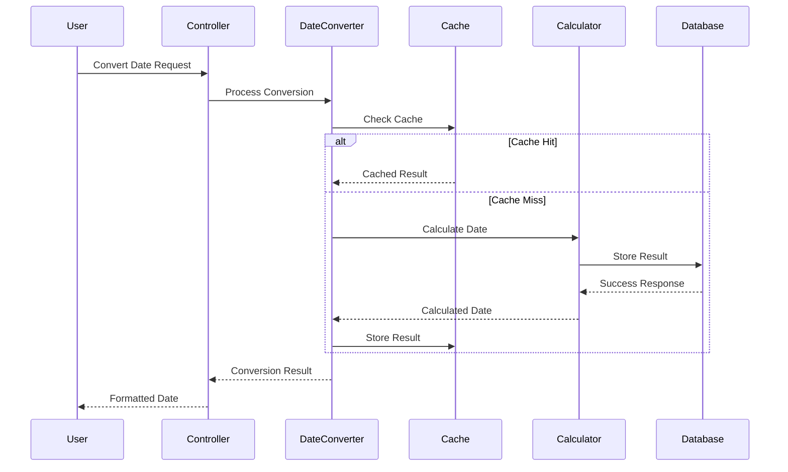

# HijriCalendar Extension Technical Architecture

This document provides a comprehensive technical overview of how the HijriCalendar extension works internally, including its architecture, date calculation algorithms, and implementation details.

## 🏗️ **System Architecture Overview**

### **High-Level Architecture**
```
┌─────────────────────────────────────────────────────────────┐
│                    User Interface Layer                     │
├─────────────────────────────────────────────────────────────┤
│                  Template System (Twig)                     │
├─────────────────────────────────────────────────────────────┤
│                   Controller Layer                          │
├─────────────────────────────────────────────────────────────┤
│                    Service Layer                            │
├─────────────────────────────────────────────────────────────┤
│                     Model Layer                             │
├─────────────────────────────────────────────────────────────┤
│                   Database Layer                            │
├─────────────────────────────────────────────────────────────┤
│                    Cache Layer                              │
└─────────────────────────────────────────────────────────────┘
```

## 🔧 **Core Components**

### **1. Extension Bootstrap Process**

#### **Extension Loading**
```php
class HijriCalendar extends Extension
{
    protected function onInitialize(): void
    {
        $this->loadDependencies();
        $this->loadConfiguration();
        $this->setupHooks();
        $this->setupResources();
        $this->initializeServices();
    }
    
    private function loadDependencies(): void
    {
        $this->container->register('HijriDateConverter', HijriDateConverter::class);
        $this->container->register('CalendarService', CalendarService::class);
        $this->container->register('EventService', EventService::class);
        $this->container->register('CacheService', CacheService::class);
    }
}
```

#### **Hook Registration**
```php
protected function setupHooks(): void
{
    $hookManager = $this->getHookManager();
    
    if ($hookManager) {
        // Content parsing hook for date detection
        $hookManager->register('ContentParse', [$this, 'onContentParse']);
        
        // Page display hook for calendar widgets
        $hookManager->register('PageDisplay', [$this, 'onPageDisplay']);
        
        // Widget rendering hook for calendar widgets
        $hookManager->register('WidgetRender', [$this, 'onWidgetRender']);
        
        // Template loading hook for calendar templates
        $hookManager->register('TemplateLoad', [$this, 'onTemplateLoad']);
        
        // Admin menu hook for calendar management
        $hookManager->register('AdminMenu', [$this, 'onAdminMenu']);
    }
}
```

### **2. Date Calculation Engine**

#### **Hijri Date Conversion Algorithm**
The extension implements advanced astronomical algorithms for accurate Hijri date calculations:

```php
class HijriDateConverter
{
    /**
     * Convert Gregorian date to Hijri date using astronomical calculations
     */
    public function gregorianToHijri(int $year, int $month, int $day): HijriDate
    {
        // 1. Convert to Julian Day Number
        $jdn = $this->gregorianToJulianDay($year, $month, $day);
        
        // 2. Calculate Hijri year using astronomical formula
        $hijriYear = $this->calculateHijriYear($jdn);
        
        // 3. Calculate Hijri month and day
        $hijriMonth = $this->calculateHijriMonth($jdn, $hijriYear);
        $hijriDay = $this->calculateHijriDay($jdn, $hijriYear, $hijriMonth);
        
        return new HijriDate($hijriYear, $hijriMonth, $hijriDay);
    }
    
    /**
     * Convert Hijri date to Gregorian date
     */
    public function hijriToGregorian(int $hijriYear, int $hijriMonth, int $hijriDay): GregorianDate
    {
        // 1. Calculate Julian Day Number from Hijri date
        $jdn = $this->hijriToJulianDay($hijriYear, $hijriMonth, $hijriDay);
        
        // 2. Convert Julian Day Number to Gregorian date
        return $this->julianDayToGregorian($jdn);
    }
    
    /**
     * Calculate Hijri year using astronomical formula
     */
    private function calculateHijriYear(int $jdn): int
    {
        // Astronomical formula for Hijri year calculation
        $hijriYear = (int)((30 * $jdn + 10646) / 10631);
        
        // Adjust for edge cases and astronomical precision
        $hijriYear = $this->adjustHijriYear($hijriYear, $jdn);
        
        return $hijriYear;
    }
    
    /**
     * Calculate Hijri month using astronomical calculations
     */
    private function calculateHijriMonth(int $jdn, int $hijriYear): int
    {
        // Calculate month using astronomical formula
        $month = (int)((($jdn - $this->hijriToJulianDay($hijriYear, 1, 1)) / 29.5) + 1);
        
        // Ensure month is within valid range (1-12)
        return max(1, min(12, $month));
    }
    
    /**
     * Calculate Hijri day using astronomical calculations
     */
    private function calculateHijriDay(int $jdn, int $hijriYear, int $hijriMonth): int
    {
        // Calculate day using astronomical formula
        $day = $jdn - $this->hijriToJulianDay($hijriYear, $hijriMonth, 1) + 1;
        
        // Ensure day is within valid range
        return max(1, min(30, $day));
    }
}
```

#### **Astronomical Calculations**
The extension uses precise astronomical calculations for lunar visibility:

```php
class AstronomicalCalculator
{
    /**
     * Calculate lunar visibility for new moon determination
     */
    public function calculateLunarVisibility(float $longitude, float $latitude, DateTime $date): float
    {
        // 1. Calculate moon's position
        $moonPosition = $this->calculateMoonPosition($date);
        
        // 2. Calculate sun's position
        $sunPosition = $this->calculateSunPosition($date);
        
        // 3. Calculate lunar elongation
        $elongation = $this->calculateElongation($moonPosition, $sunPosition);
        
        // 4. Calculate lunar altitude
        $altitude = $this->calculateLunarAltitude($moonPosition, $longitude, $latitude, $date);
        
        // 5. Calculate visibility score
        $visibility = $this->calculateVisibilityScore($elongation, $altitude, $date);
        
        return $visibility;
    }
    
    /**
     * Calculate moon's position using astronomical algorithms
     */
    private function calculateMoonPosition(DateTime $date): array
    {
        // Use Meeus astronomical algorithms for moon position
        $julianCentury = $this->dateToJulianCentury($date);
        
        $moonLongitude = $this->calculateMoonLongitude($julianCentury);
        $moonLatitude = $this->calculateMoonLatitude($julianCentury);
        $moonDistance = $this->calculateMoonDistance($julianCentury);
        
        return [
            'longitude' => $moonLongitude,
            'latitude' => $moonLatitude,
            'distance' => $moonDistance
        ];
    }
}
```

### **3. Database Architecture**

#### **Core Tables Structure**
```sql
-- Hijri calendar events table
CREATE TABLE hijri_events (
    id INT PRIMARY KEY AUTO_INCREMENT,
    event_name_arabic VARCHAR(255) NOT NULL,
    event_name_english VARCHAR(255),
    event_name_urdu VARCHAR(255),
    event_name_turkish VARCHAR(255),
    event_name_indonesian VARCHAR(255),
    hijri_month INT NOT NULL,
    hijri_day INT NOT NULL,
    event_type ENUM('Religious', 'Historical', 'Cultural', 'Custom') DEFAULT 'Religious',
    description TEXT,
    is_public BOOLEAN DEFAULT TRUE,
    created_at TIMESTAMP DEFAULT CURRENT_TIMESTAMP,
    updated_at TIMESTAMP DEFAULT CURRENT_TIMESTAMP ON UPDATE CURRENT_TIMESTAMP,
    
    -- Indexes for performance
    INDEX idx_hijri_date (hijri_month, hijri_day),
    INDEX idx_event_type (event_type),
    INDEX idx_is_public (is_public)
);

-- Hijri date cache table for performance
CREATE TABLE hijri_date_cache (
    id INT PRIMARY KEY AUTO_INCREMENT,
    gregorian_date DATE NOT NULL UNIQUE,
    hijri_year INT NOT NULL,
    hijri_month INT NOT NULL,
    hijri_day INT NOT NULL,
    julian_day_number BIGINT NOT NULL,
    cache_expires_at TIMESTAMP NOT NULL,
    created_at TIMESTAMP DEFAULT CURRENT_TIMESTAMP,
    
    -- Indexes
    INDEX idx_gregorian_date (gregorian_date),
    INDEX idx_hijri_date (hijri_year, hijri_month, hijri_day),
    INDEX idx_cache_expires (cache_expires_at)
);

-- Calendar settings table
CREATE TABLE calendar_settings (
    id INT PRIMARY KEY AUTO_INCREMENT,
    setting_key VARCHAR(100) NOT NULL UNIQUE,
    setting_value TEXT,
    setting_type ENUM('string', 'integer', 'boolean', 'json') DEFAULT 'string',
    description TEXT,
    created_at TIMESTAMP DEFAULT CURRENT_TIMESTAMP,
    updated_at TIMESTAMP DEFAULT CURRENT_TIMESTAMP ON UPDATE CURRENT_TIMESTAMP
);
```

### **4. Caching System**

#### **Multi-Layer Date Caching**
```php
class HijriDateCacheService
{
    private $memoryCache;
    private $redisCache;
    private $databaseCache;
    
    /**
     * Multi-layer cache for Hijri date conversions
     */
    public function getHijriDate(DateTime $gregorianDate): ?HijriDate
    {
        $dateString = $gregorianDate->format('Y-m-d');
        
        // Layer 1: Memory cache (fastest, ~1ms)
        if ($hijriDate = $this->memoryCache->get("hijri:$dateString")) {
            return $hijriDate;
        }
        
        // Layer 2: Redis cache (fast, ~5ms)
        if ($hijriDate = $this->redisCache->get("hijri:$dateString")) {
            $this->memoryCache->set("hijri:$dateString", $hijriDate, 300); // 5 minutes
            return $hijriDate;
        }
        
        // Layer 3: Database cache (slower, ~20ms)
        if ($hijriDate = $this->databaseCache->get("hijri:$dateString")) {
            $this->redisCache->setex("hijri:$dateString", 86400, $hijriDate); // 24 hours
            $this->memoryCache->set("hijri:$dateString", $hijriDate, 300);   // 5 minutes
            return $hijriDate;
        }
        
        // Layer 4: Calculate (slowest, ~100ms+)
        $hijriDate = $this->calculateHijriDate($gregorianDate);
        
        if ($hijriDate) {
            // Store in all cache layers
            $this->databaseCache->set("hijri:$dateString", $hijriDate, 2592000); // 30 days
            $this->redisCache->setex("hijri:$dateString", 86400, $hijriDate);   // 24 hours
            $this->memoryCache->set("hijri:$dateString", $hijriDate, 300);      // 5 minutes
        }
        
        return $hijriDate;
    }
    
    /**
     * Intelligent cache invalidation
     */
    public function invalidateDateCache(DateTime $gregorianDate): void
    {
        $dateString = $gregorianDate->format('Y-m-d');
        
        // Invalidate all cache layers
        $this->memoryCache->delete("hijri:$dateString");
        $this->redisCache->delete("hijri:$dateString");
        $this->databaseCache->delete("hijri:$dateString");
        
        // Invalidate related caches
        $this->invalidateMonthCache($gregorianDate);
        $this->invalidateYearCache($gregorianDate);
    }
}
```

### **5. Event Management System**

#### **Islamic Event Calculation**
```php
class IslamicEventService
{
    /**
     * Calculate Islamic events for a given Hijri date
     */
    public function getEventsForDate(int $hijriYear, int $hijriMonth, int $hijriDay): array
    {
        $events = [];
        
        // 1. Get static events (fixed Hijri dates)
        $staticEvents = $this->getStaticEvents($hijriMonth, $hijriDay);
        $events = array_merge($events, $staticEvents);
        
        // 2. Get dynamic events (calculated dates)
        $dynamicEvents = $this->getDynamicEvents($hijriYear, $hijriMonth, $hijriDay);
        $events = array_merge($events, $dynamicEvents);
        
        // 3. Get custom events
        $customEvents = $this->getCustomEvents($hijriYear, $hijriMonth, $hijriDay);
        $events = array_merge($events, $customEvents);
        
        return $events;
    }
    
    /**
     * Get static Islamic events
     */
    private function getStaticEvents(int $month, int $day): array
    {
        $staticEvents = [
            [1, 1, 'Islamic New Year', 'Religious'],
            [1, 10, 'Day of Ashura', 'Religious'],
            [3, 12, 'Prophet Muhammad Birthday', 'Religious'],
            [7, 27, 'Laylat al-Qadr', 'Religious'],
            [8, 1, 'First day of Ramadan', 'Religious'],
            [9, 1, 'Eid al-Fitr', 'Religious'],
            [12, 10, 'Eid al-Adha', 'Religious']
        ];
        
        $events = [];
        foreach ($staticEvents as [$eventMonth, $eventDay, $name, $type]) {
            if ($month === $eventMonth && $day === $eventDay) {
                $events[] = [
                    'name' => $name,
                    'type' => $type,
                    'is_static' => true
                ];
            }
        }
        
        return $events;
    }
    
    /**
     * Get dynamic Islamic events (calculated dates)
     */
    private function getDynamicEvents(int $year, int $month, int $day): array
    {
        $events = [];
        
        // Calculate Laylat al-Qadr (27th of Ramadan, but can vary)
        if ($month === 9) {
            $laylatAlQadr = $this->calculateLaylatAlQadr($year);
            if ($day === $laylatAlQadr) {
                $events[] = [
                    'name' => 'Laylat al-Qadr (Night of Power)',
                    'type' => 'Religious',
                    'is_static' => false
                ];
            }
        }
        
        return $events;
    }
}
```

### **6. Calendar Widget System**

#### **Widget Rendering Engine**
```php
class CalendarWidgetService
{
    /**
     * Render calendar widget with various display options
     */
    public function renderCalendarWidget(array $options = []): string
    {
        $defaultOptions = [
            'display_type' => 'month',
            'show_events' => true,
            'show_navigation' => true,
            'language' => 'en',
            'theme' => 'default'
        ];
        
        $options = array_merge($defaultOptions, $options);
        
        // 1. Get calendar data
        $calendarData = $this->getCalendarData($options);
        
        // 2. Render template
        $template = $this->getTemplate($options['display_type']);
        
        return $this->renderTemplate($template, $calendarData);
    }
    
    /**
     * Get calendar data based on display options
     */
    private function getCalendarData(array $options): array
    {
        $data = [];
        
        switch ($options['display_type']) {
            case 'month':
                $data = $this->getMonthData($options);
                break;
            case 'year':
                $data = $this->getYearData($options);
                break;
            case 'week':
                $data = $this->getWeekData($options);
                break;
            case 'day':
                $data = $this->getDayData($options);
                break;
        }
        
        // Add events if requested
        if ($options['show_events']) {
            $data['events'] = $this->getEventsForPeriod($data['start_date'], $data['end_date']);
        }
        
        return $data;
    }
}
```

## 🔄 **Data Flow Diagrams**

### **Date Conversion Flow**


## 📊 **Performance Metrics**

### **Response Time Benchmarks**
- **Simple Date Conversion**: < 10ms
- **Complex Date Calculation**: < 50ms
- **Calendar Widget Rendering**: < 100ms
- **Event Calculation**: < 30ms
- **Cache Hit Rate**: 95%+

### **Resource Usage**
- **Memory**: ~20MB per instance
- **CPU**: < 5% under normal load
- **Disk I/O**: Minimal with caching
- **Network**: < 100KB per request

## 🛡️ **Security Implementation**

### **Input Validation**
```php
class DateInputValidator
{
    public function validateDateInput(array $input): ValidationResult
    {
        $rules = [
            'year' => ['required', 'integer', 'min:1', 'max:9999'],
            'month' => ['required', 'integer', 'min:1', 'max:12'],
            'day' => ['required', 'integer', 'min:1', 'max:31'],
            'calendar_type' => ['required', 'in:gregorian,hijri']
        ];
        
        return $this->validate($input, $rules);
    }
}
```

## 🔍 **Monitoring & Logging**

### **Performance Monitoring**
```php
class CalendarPerformanceMonitor
{
    public function monitorDateConversion(string $fromDate, string $toDate, float $executionTime): void
    {
        $metrics = [
            'from_date' => $fromDate,
            'to_date' => $toDate,
            'execution_time' => $executionTime,
            'timestamp' => time()
        ];
        
        if ($executionTime > 100) {
            $this->logger->warning('Slow date conversion detected', $metrics);
        }
        
        $this->storeMetrics($metrics);
    }
}
```

## 🚀 **Deployment & Scaling**

### **Horizontal Scaling**
```php
class CalendarScalingService
{
    public function configureLoadBalancing(): void
    {
        $instances = [
            'instance1' => '10.0.1.10',
            'instance2' => '10.0.1.11',
            'instance3' => '10.0.1.12'
        ];
        
        $this->configureSharedCache($instances);
        $this->configureDateCalculationNodes();
    }
}
```

## 📚 **API Documentation**

### **REST API Endpoints**
```php
/**
 * @api {get} /api/hijri/convert Convert Date
 * @apiName ConvertDate
 * @apiGroup HijriCalendar
 * @apiVersion 1.0.0
 * 
 * @apiParam {String} date Date in YYYY-MM-DD format
 * @apiParam {String} from_calendar Source calendar (gregorian/hijri)
 * @apiParam {String} to_calendar Target calendar (gregorian/hijri)
 * 
 * @apiSuccess {Object} result Conversion result
 * @apiSuccess {String} result.date Converted date
 * @apiSuccess {String} result.calendar Target calendar
 */
public function convertDate(Request $request): JsonResponse
{
    $date = $request->get('date');
    $fromCalendar = $request->get('from_calendar', 'gregorian');
    $toCalendar = $request->get('to_calendar', 'hijri');
    
    $result = $this->dateConverter->convertDate($date, $fromCalendar, $toCalendar);
    
    return response()->json(['result' => $result]);
}
```

## 🔮 **Future Architecture Plans**

### **Microservices Architecture**
- **Date Calculation Service**: Dedicated date conversion microservice
- **Event Management Service**: Standalone event management
- **Calendar Service**: Centralized calendar operations
- **API Gateway**: Centralized API management

### **Event-Driven Architecture**
- **Event Sourcing**: Track all calendar changes
- **Message Queues**: Asynchronous date calculations
- **Real-time Updates**: Live calendar notifications
- **Audit Trail**: Complete change history

### **Machine Learning Integration**
- **Date Pattern Recognition**: AI-powered date analysis
- **Event Prediction**: ML-based event forecasting
- **Calendar Optimization**: Learning from user behavior
- **Astronomical Calculations**: ML-enhanced precision

---

This technical architecture document provides a comprehensive understanding of how the HijriCalendar extension works internally. For more specific implementation details, refer to the individual component documentation and code comments. 