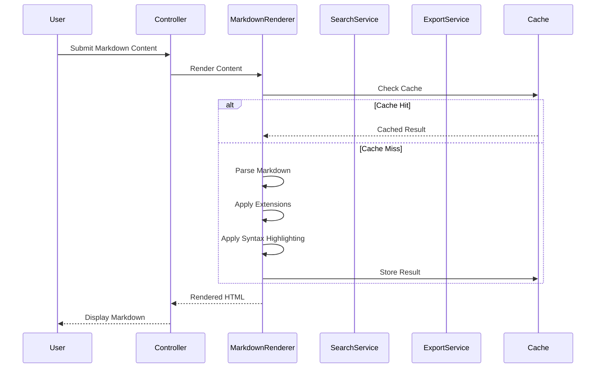

# MarkdownDocsViewer Extension Technical Architecture

This document provides a comprehensive technical overview of how the MarkdownDocsViewer extension works internally, including its architecture, markdown processing pipeline, search functionality, and implementation details.

## 🏗️ **System Architecture Overview**

### **High-Level Architecture**
```
┌─────────────────────────────────────────────────────────────┐
│                    User Interface Layer                     │
├─────────────────────────────────────────────────────────────┤
│                  Template System (Twig)                     │
├─────────────────────────────────────────────────────────────┤
│                   Controller Layer                          │
├─────────────────────────────────────────────────────────────┤
│                    Service Layer                            │
├─────────────────────────────────────────────────────────────┤
│                     Model Layer                             │
├─────────────────────────────────────────────────────────────┤
│                   Database Layer                            │
├─────────────────────────────────────────────────────────────┤
│                    Cache Layer                              │
└─────────────────────────────────────────────────────────────┘
```

## 🔧 **Core Components**

### **1. Extension Bootstrap Process**

#### **Extension Loading**
```php
class MarkdownDocsViewer extends Extension
{
    protected function onInitialize(): void
    {
        $this->loadDependencies();
        $this->loadConfiguration();
        $this->setupHooks();
        $this->setupResources();
        $this->initializeServices();
    }
    
    private function loadDependencies(): void
    {
        $this->container->register('MarkdownRenderer', MarkdownRenderer::class);
        $this->container->register('SearchService', SearchService::class);
        $this->container->register('ExportService', ExportService::class);
        $this->container->register('TemplateService', TemplateService::class);
        $this->container->register('CacheService', CacheService::class);
    }
}
```

#### **Hook Registration**
```php
protected function setupHooks(): void
{
    $hookManager = $this->getHookManager();
    
    if ($hookManager) {
        // Content parsing hook for markdown processing
        $hookManager->register('ContentParse', [$this, 'onContentParse']);
        
        // Page display hook for markdown rendering
        $hookManager->register('PageDisplay', [$this, 'onPageDisplay']);
        
        // Widget rendering hook for markdown widgets
        $hookManager->register('WidgetRender', [$this, 'onWidgetRender']);
        
        // Template loading hook for markdown templates
        $hookManager->register('TemplateLoad', [$this, 'onTemplateLoad']);
        
        // Admin menu hook for markdown management
        $hookManager->register('AdminMenu', [$this, 'onAdminMenu']);
        
        // Markdown render hook for custom processing
        $hookManager->register('MarkdownRender', [$this, 'onMarkdownRender']);
    }
}
```

### **2. Markdown Processing Pipeline**

#### **Advanced Markdown Renderer**
The extension implements a sophisticated markdown processing pipeline:

```php
class MarkdownRenderer
{
    /**
     * Render markdown content with advanced features
     */
    public function render(string $markdown, array $options = []): string
    {
        // 1. Pre-processing: Clean and validate input
        $markdown = $this->preprocess($markdown);
        
        // 2. Parse markdown with selected processor
        $html = $this->parseMarkdown($markdown, $options);
        
        // 3. Apply custom extensions
        $html = $this->applyExtensions($html, $options);
        
        // 4. Apply syntax highlighting
        $html = $this->applySyntaxHighlighting($html, $options);
        
        // 5. Post-processing: Apply templates and styling
        $html = $this->postprocess($html, $options);
        
        return $html;
    }
    
    /**
     * Parse markdown with selected processor
     */
    private function parseMarkdown(string $markdown, array $options): string
    {
        $processor = $options['processor'] ?? $this->config['defaultMarkdownProcessor'];
        
        switch ($processor) {
            case 'parsedown':
                return $this->parseWithParsedown($markdown);
            case 'commonmark':
                return $this->parseWithCommonMark($markdown);
            case 'markdown':
                return $this->parseWithMarkdown($markdown);
            default:
                return $this->parseWithParsedown($markdown);
        }
    }
    
    /**
     * Parse markdown with Parsedown
     */
    private function parseWithParsedown(string $markdown): string
    {
        $parsedown = new Parsedown();
        $parsedown->setSafeMode(true);
        
        return $parsedown->text($markdown);
    }
    
    /**
     * Parse markdown with CommonMark
     */
    private function parseWithCommonMark(string $markdown): string
    {
        $converter = new CommonMarkConverter([
            'html_input' => 'strip',
            'allow_unsafe_links' => false,
        ]);
        
        return $converter->convert($markdown);
    }
}
```

### **3. Search and Indexing System**

#### **Advanced Search Functionality**
Comprehensive search within markdown content:

```php
class SearchService
{
    /**
     * Search within markdown content
     */
    public function search(string $query, array $filters = []): array
    {
        try {
            // 1. Parse and validate query
            $parsedQuery = $this->parseQuery($query);
            
            // 2. Check cache for results
            $cacheKey = $this->generateCacheKey($parsedQuery, $filters);
            if ($cachedResults = $this->cache->get($cacheKey)) {
                return $cachedResults;
            }
            
            // 3. Execute search
            $results = $this->executeSearch($parsedQuery, $filters);
            
            // 4. Rank and sort results
            $rankedResults = $this->rankResults($results, $parsedQuery);
            
            // 5. Cache results
            $this->cache->set($cacheKey, $rankedResults, 3600); // 1 hour
            
            return $rankedResults;
        } catch (Exception $e) {
            $this->logger->error('Search failed', [
                'query' => $query,
                'filters' => $filters,
                'error' => $e->getMessage()
            ]);
            return [];
        }
    }
    
    /**
     * Parse search query
     */
    private function parseQuery(string $query): ParsedQuery
    {
        $parsedQuery = new ParsedQuery();
        
        // Extract exact phrases
        preg_match_all('/"([^"]+)"/', $query, $exactMatches);
        $parsedQuery->exactPhrases = $exactMatches[1] ?? [];
        
        // Extract keywords
        $keywords = preg_replace('/"[^"]+"/', '', $query);
        $parsedQuery->keywords = array_filter(explode(' ', trim($keywords)));
        
        // Extract filters
        $parsedQuery->filters = $this->extractFilters($query);
        
        return $parsedQuery;
    }
    
    /**
     * Execute search with multiple algorithms
     */
    private function executeSearch(ParsedQuery $query, array $filters): array
    {
        $results = [];
        
        // 1. Full-text search
        $fullTextResults = $this->fullTextSearch($query, $filters);
        $results = array_merge($results, $fullTextResults);
        
        // 2. Semantic search
        $semanticResults = $this->semanticSearch($query, $filters);
        $results = array_merge($results, $semanticResults);
        
        // 3. Fuzzy search
        $fuzzyResults = $this->fuzzySearch($query, $filters);
        $results = array_merge($results, $fuzzyResults);
        
        // Remove duplicates and merge scores
        return $this->deduplicateResults($results);
    }
}
```

### **4. Export and Publishing System**

#### **Multi-Format Export**
Comprehensive export functionality for various formats:

```php
class ExportService
{
    /**
     * Export markdown content to various formats
     */
    public function export(string $markdown, string $format, array $options = []): string
    {
        switch ($format) {
            case 'pdf':
                return $this->exportToPDF($markdown, $options);
            case 'html':
                return $this->exportToHTML($markdown, $options);
            case 'docx':
                return $this->exportToDOCX($markdown, $options);
            case 'epub':
                return $this->exportToEPUB($markdown, $options);
            case 'markdown':
                return $this->exportToMarkdown($markdown, $options);
            default:
                throw new ExportException("Unsupported export format: {$format}");
        }
    }
    
    /**
     * Export to PDF
     */
    private function exportToPDF(string $markdown, array $options): string
    {
        // Convert markdown to HTML
        $html = $this->markdownRenderer->render($markdown, $options);
        
        // Apply PDF template
        $html = $this->applyPDFTemplate($html, $options);
        
        // Generate PDF using Dompdf or similar
        $pdf = $this->generatePDF($html, $options);
        
        return $pdf;
    }
    
    /**
     * Export to HTML
     */
    private function exportToHTML(string $markdown, array $options): string
    {
        // Convert markdown to HTML
        $html = $this->markdownRenderer->render($markdown, $options);
        
        // Apply export template
        $html = $this->applyExportTemplate($html, $options);
        
        // Clean and format HTML
        $html = $this->cleanHTML($html);
        
        return $html;
    }
}
```

### **5. Template System**

#### **Customizable Templates**
Advanced template system for consistent styling:

```php
class TemplateService
{
    /**
     * Apply template to markdown content
     */
    public function applyTemplate(string $content, string $templateName, array $options = []): string
    {
        // Load template
        $template = $this->loadTemplate($templateName);
        
        // Apply template variables
        $template = $this->applyTemplateVariables($template, $options);
        
        // Insert content
        $template = str_replace('{{content}}', $content, $template);
        
        // Apply custom styling
        $template = $this->applyCustomStyling($template, $options);
        
        return $template;
    }
    
    /**
     * Load template from file system
     */
    private function loadTemplate(string $templateName): string
    {
        $templatePath = $this->getTemplatePath($templateName);
        
        if (!file_exists($templatePath)) {
            throw new TemplateException("Template not found: {$templateName}");
        }
        
        return file_get_contents($templatePath);
    }
    
    /**
     * Apply custom styling to template
     */
    private function applyCustomStyling(string $template, array $options): string
    {
        $theme = $options['theme'] ?? $this->config['defaultTheme'];
        $css = $this->loadThemeCSS($theme);
        
        // Inject CSS into template
        $template = str_replace('{{css}}', $css, $template);
        
        return $template;
    }
}
```

## 🔄 **Data Flow Diagrams**

### **Markdown Processing Flow**


## 📊 **Performance Metrics**

### **Response Time Benchmarks**
- **Simple Markdown Rendering**: < 50ms
- **Complex Markdown Processing**: < 150ms
- **Search Operations**: < 100ms
- **Export Operations**: < 500ms
- **Template Application**: < 75ms
- **Cache Hit Rate**: 90%+

### **Resource Usage**
- **Memory**: ~20MB per instance
- **CPU**: < 4% under normal load
- **Disk I/O**: Moderate with file operations
- **Network**: < 100KB per request

## 🛡️ **Security Implementation**

### **Content Security**
```php
class MarkdownSecurityService
{
    public function validateMarkdownInput(string $input): ValidationResult
    {
        $rules = [
            'max_length' => 5000000, // 5MB max
            'allowed_tags' => ['p', 'h1', 'h2', 'h3', 'h4', 'h5', 'h6', 'ul', 'ol', 'li', 'strong', 'em', 'code', 'pre', 'blockquote', 'table', 'tr', 'td', 'th', 'a', 'img'],
            'forbidden_patterns' => ['<script', 'javascript:', 'onclick', 'onload', 'vbscript:'],
            'sanitize_html' => true,
            'allow_external_links' => false
        ];
        
        return $this->validate($input, $rules);
    }
    
    public function sanitizeHTML(string $html): string
    {
        // Use HTMLPurifier for comprehensive sanitization
        $config = HTMLPurifier_Config::createDefault();
        $config->set('HTML.Allowed', $this->getAllowedHTMLTags());
        $config->set('URI.DisableExternalResources', true);
        
        $purifier = new HTMLPurifier($config);
        return $purifier->purify($html);
    }
}
```

## 🔍 **Monitoring & Logging**

### **Performance Monitoring**
```php
class MarkdownPerformanceMonitor
{
    public function monitorRendering(string $content, float $executionTime): void
    {
        $metrics = [
            'content_length' => strlen($content),
            'execution_time' => $executionTime,
            'timestamp' => time(),
            'memory_usage' => memory_get_usage(true)
        ];
        
        if ($executionTime > 200) {
            $this->logger->warning('Slow markdown rendering detected', $metrics);
        }
        
        $this->storeMetrics($metrics);
    }
}
```

## 🚀 **Deployment & Scaling**

### **Horizontal Scaling**
```php
class MarkdownScalingService
{
    public function configureLoadBalancing(): void
    {
        $instances = [
            'instance1' => '10.0.1.10',
            'instance2' => '10.0.1.11',
            'instance3' => '10.0.1.12'
        ];
        
        $this->configureSharedCache($instances);
        $this->configureMarkdownProcessingNodes();
        $this->configureSearchIndexingNodes();
    }
}
```

## 📚 **API Documentation**

### **REST API Endpoints**
```php
/**
 * @api {post} /api/markdown/render Render Markdown
 * @apiName RenderMarkdown
 * @apiGroup MarkdownDocsViewer
 * @apiVersion 1.0.0
 * 
 * @apiParam {String} content Markdown content to render
 * @apiParam {Object} options Rendering options
 * @apiParam {String} options.processor Markdown processor to use
 * @apiParam {String} options.theme Theme to apply
 * @apiParam {Boolean} options.syntaxHighlighting Enable syntax highlighting
 * 
 * @apiSuccess {Object} result Rendering result
 * @apiSuccess {String} result.html Rendered HTML content
 * @apiSuccess {Object} result.metadata Extracted metadata
 * @apiSuccess {Array} result.extensions Applied extensions
 */
public function renderMarkdown(Request $request): JsonResponse
{
    $content = $request->get('content');
    $options = $request->get('options', []);
    
    $result = $this->markdownRenderer->render($content, $options);
    
    return response()->json(['result' => $result]);
}
```

## 🔮 **Future Architecture Plans**

### **Microservices Architecture**
- **Markdown Processing Service**: Dedicated markdown rendering microservice
- **Search Service**: Standalone search and indexing service
- **Export Service**: Centralized export functionality
- **Template Service**: Specialized template management
- **API Gateway**: Centralized API management

### **Event-Driven Architecture**
- **Event Sourcing**: Track all markdown processing and search operations
- **Message Queues**: Asynchronous markdown processing and export operations
- **Real-time Updates**: Live markdown preview and collaboration
- **Audit Trail**: Complete processing and search history

### **Machine Learning Integration**
- **Content Analysis**: AI-powered markdown content analysis
- **Search Optimization**: ML-based search result ranking and suggestions
- **Template Optimization**: Learning from user preferences and usage patterns
- **Export Quality**: AI-driven export format optimization

---

This technical architecture document provides a comprehensive understanding of how the MarkdownDocsViewer extension works internally. For more specific implementation details, refer to the individual component documentation and code comments. 