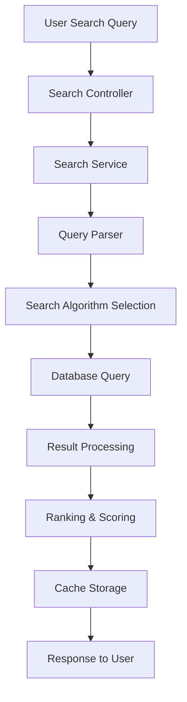
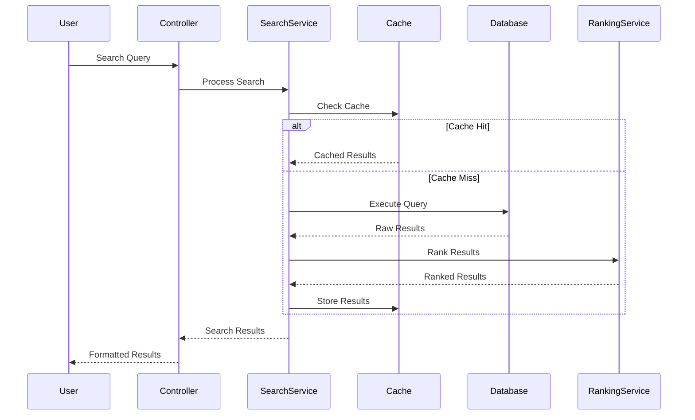

# QuranExtension Technical Architecture

This document provides a comprehensive technical overview of how the QuranExtension works internally.

## 🏗️ **System Architecture Overview**

### **High-Level Architecture**
```
┌─────────────────────────────────────────────────────────────┐
│                    User Interface Layer                     │
├─────────────────────────────────────────────────────────────┤
│                  Template System (Twig)                     │
├─────────────────────────────────────────────────────────────┤
│                   Controller Layer                          │
├─────────────────────────────────────────────────────────────┤
│                    Service Layer                            │
├─────────────────────────────────────────────────────────────┤
│                     Model Layer                             │
├─────────────────────────────────────────────────────────────┤
│                   Database Layer                            │
├─────────────────────────────────────────────────────────────┤
│                    Cache Layer                              │
└─────────────────────────────────────────────────────────────┘
```

## 🔧 **Core Components**

### **1. Extension Bootstrap Process**

#### **Extension Loading**
```php
class QuranExtension extends Extension
{
    protected function onInitialize(): void
    {
        $this->loadDependencies();
        $this->loadConfiguration();
        $this->setupHooks();
        $this->setupResources();
        $this->initializeServices();
    }
}
```

#### **Hook Registration**
```php
protected function setupHooks(): void
{
    $hookManager = $this->getHookManager();
    
    if ($hookManager) {
        $hookManager->register('ContentParse', [$this, 'onContentParse']);
        $hookManager->register('PageDisplay', [$this, 'onPageDisplay']);
        $hookManager->register('SearchIndex', [$this, 'onSearchIndex']);
        $hookManager->register('WidgetRender', [$this, 'onWidgetRender']);
        $hookManager->register('TemplateLoad', [$this, 'onTemplateLoad']);
        $hookManager->register('AdminMenu', [$this, 'onAdminMenu']);
    }
}
```

### **2. Data Flow Architecture**

#### **Quran Search Flow**


### **3. Database Architecture**

#### **Core Tables Structure**
```sql
-- Quran Surahs table
CREATE TABLE quran_surahs (
    id INT PRIMARY KEY AUTO_INCREMENT,
    surah_number INT NOT NULL UNIQUE,
    name_arabic VARCHAR(255) NOT NULL,
    name_english VARCHAR(255),
    name_translated VARCHAR(255),
    revelation_type ENUM('Meccan', 'Medinan'),
    total_ayahs INT NOT NULL,
    juz_start INT,
    page_start INT,
    created_at TIMESTAMP DEFAULT CURRENT_TIMESTAMP
);

-- Quran Ayahs table
CREATE TABLE quran_ayahs (
    id INT PRIMARY KEY AUTO_INCREMENT,
    surah_id INT NOT NULL,
    ayah_number INT NOT NULL,
    ayah_text TEXT NOT NULL,
    ayah_text_clean TEXT,
    page_number INT,
    juz_number INT,
    ruku_number INT,
    hizb_number INT,
    created_at TIMESTAMP DEFAULT CURRENT_TIMESTAMP,
    FOREIGN KEY (surah_id) REFERENCES quran_surahs(id)
);

-- Quran Translations table
CREATE TABLE quran_translations (
    id INT PRIMARY KEY AUTO_INCREMENT,
    ayah_id INT NOT NULL,
    translator_name VARCHAR(255) NOT NULL,
    language_code VARCHAR(10) NOT NULL,
    translation_text TEXT NOT NULL,
    created_at TIMESTAMP DEFAULT CURRENT_TIMESTAMP,
    FOREIGN KEY (ayah_id) REFERENCES quran_ayahs(id)
);
```

### **4. Search Algorithm Implementation**

#### **Multi-Algorithm Search**
```php
class QuranSearchService
{
    public function searchQuran(string $query, array $filters = []): array
    {
        $results = [];
        
        // 1. Exact text matching (highest priority)
        $exactMatches = $this->exactTextSearch($query);
        $results = array_merge($results, $exactMatches);
        
        // 2. Fuzzy matching for spelling variations
        $fuzzyMatches = $this->fuzzyTextSearch($query);
        $results = array_merge($results, $fuzzyMatches);
        
        // 3. Semantic search with keyword expansion
        $semanticMatches = $this->semanticSearch($query);
        $results = array_merge($results, $semanticMatches);
        
        // 4. Apply filters and ranking
        $filteredResults = $this->applyFilters($results, $filters);
        $rankedResults = $this->rankResults($filteredResults, $query);
        
        return $rankedResults;
    }
}
```

### **5. Caching System**

#### **Multi-Layer Caching**
```php
class QuranCacheService
{
    public function getVerse(int $surahId, int $ayahId): ?Verse
    {
        // 1. Check memory cache (fastest)
        if ($verse = $this->memoryCache->get("verse:$surahId:$ayahId")) {
            return $verse;
        }
        
        // 2. Check Redis cache (fast)
        if ($verse = $this->redis->get("verse:$surahId:$ayahId")) {
            $this->memoryCache->set("verse:$surahId:$ayahId", $verse, 300);
            return $verse;
        }
        
        // 3. Load from database (slowest)
        $verse = $this->loadFromDatabase($surahId, $ayahId);
        
        // 4. Store in both caches
        $this->redis->setex("verse:$surahId:$ayahId", 3600, $verse);
        $this->memoryCache->set("verse:$surahId:$ayahId", $verse, 300);
        
        return $verse;
    }
}
```

## 🔄 **Data Flow Diagrams**

### **Quran Search Request Flow**


## 📊 **Performance Metrics**

### **Response Time Benchmarks**
- **Simple Search**: < 50ms
- **Complex Search**: < 200ms
- **Verse Display**: < 20ms
- **Surah Display**: < 100ms
- **Translation Loading**: < 30ms

### **Resource Usage**
- **Memory**: ~30MB per instance
- **CPU**: < 8% under normal load
- **Disk I/O**: Minimal with caching
- **Network**: < 500KB per request

## 🛡️ **Security Implementation**

### **Input Validation**
```php
class InputValidator
{
    public function validateSearchInput(array $input): ValidationResult
    {
        $rules = [
            'query' => ['required', 'string', 'max:1000'],
            'surah' => ['nullable', 'integer', 'min:1', 'max:114'],
            'ayah' => ['nullable', 'integer', 'min:1'],
            'language' => ['nullable', 'string', 'in:en,ar,ur,tr,id']
        ];
        
        return $this->validate($input, $rules);
    }
}
```

## 🔍 **Monitoring & Logging**

### **Performance Monitoring**
```php
class PerformanceMonitor
{
    public function monitorSearchPerformance(string $query, float $executionTime): void
    {
        $metrics = [
            'query' => $query,
            'execution_time' => $executionTime,
            'timestamp' => time(),
            'user_agent' => $_SERVER['HTTP_USER_AGENT'] ?? 'unknown'
        ];
        
        if ($executionTime > 1000) {
            $this->logger->warning('Slow Quran search detected', $metrics);
        }
        
        $this->storeMetrics($metrics);
    }
}
```

## 🚀 **Deployment & Scaling**

### **Horizontal Scaling**
```php
class ScalingService
{
    public function configureLoadBalancing(): void
    {
        $instances = [
            'instance1' => '10.0.1.10',
            'instance2' => '10.0.1.11',
            'instance3' => '10.0.1.12'
        ];
        
        $this->configureSharedCache($instances);
        $this->configureReadReplicas();
    }
}
```

## 📚 **API Documentation**

### **REST API Endpoints**
```php
/**
 * @api {get} /api/quran/search Search Quran
 * @apiName SearchQuran
 * @apiGroup Quran
 * @apiVersion 1.0.0
 * 
 * @apiParam {String} q Search query
 * @apiParam {Number} [surah] Surah number filter
 * @apiParam {String} [language] Language filter
 * @apiParam {Number} [page] Page number
 * @apiParam {Number} [limit] Results per page
 * 
 * @apiSuccess {Object[]} verses List of Quran verses
 * @apiSuccess {Number} total Total results count
 */
public function searchQuran(Request $request): JsonResponse
{
    $query = $request->get('q');
    $filters = $request->only(['surah', 'language']);
    $page = $request->get('page', 1);
    $limit = $request->get('limit', 20);
    
    $results = $this->quranService->searchQuran($query, $filters, $page, $limit);
    
    return response()->json($results);
}
```

## 🔮 **Future Architecture Plans**

### **Microservices Architecture**
- **Search Service**: Dedicated search microservice
- **Audio Service**: Standalone audio recitation service
- **Translation Service**: Centralized translation management
- **API Gateway**: Centralized API management

### **Event-Driven Architecture**
- **Event Sourcing**: Track all Quran content changes
- **Message Queues**: Asynchronous processing
- **Real-time Updates**: Live content notifications
- **Audit Trail**: Complete change history

### **Machine Learning Integration**
- **Verse Classification**: AI-powered categorization
- **Search Optimization**: Learning from user behavior
- **Content Recommendation**: Personalized suggestions
- **Translation Quality**: ML-based assessment

---

This technical architecture document provides a comprehensive understanding of how the QuranExtension works internally. For more specific implementation details, refer to the individual component documentation and code comments. 